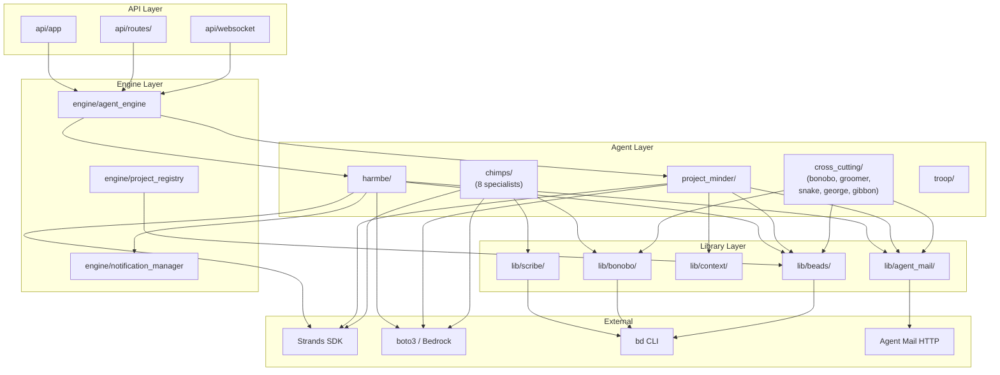

<!-- beads-issue: gt-8 -->
<!-- beads-review: gt-13 -->
# Component Dependencies -- Gorilla Troop

## Python Package Structure

```
gorilla-troop/
├── pyproject.toml                    # Project metadata, dependencies
├── orchestrator/
│   ├── __init__.py
│   ├── main.py                       # Entry point: start FastAPI + agent engine
│   ├── settings.py                   # Configuration (Bedrock, paths, defaults)
│   ├── engine/
│   │   ├── __init__.py
│   │   ├── agent_engine.py           # Agent lifecycle: start, stop, spawn
│   │   ├── project_registry.py       # Multi-project state management
│   │   └── notification_manager.py   # Notification queue and prioritization
│   ├── agents/
│   │   ├── __init__.py
│   │   ├── harmbe/
│   │   │   ├── __init__.py
│   │   │   ├── agent.py              # Harmbe Strands agent definition
│   │   │   ├── prompt.md             # System prompt (file, not inline)
│   │   │   └── tools.py              # Harmbe-specific tools
│   │   ├── project_minder/
│   │   │   ├── __init__.py
│   │   │   ├── agent.py              # PM Strands agent definition
│   │   │   ├── prompt.md             # System prompt
│   │   │   ├── graph.py              # AIDLC dependency graph engine
│   │   │   └── tools.py              # PM-specific tools
│   │   ├── chimps/
│   │   │   ├── __init__.py
│   │   │   ├── base_chimp.py         # Shared Chimp contract
│   │   │   ├── scout/                # Workspace Detection, RE
│   │   │   ├── sage/                 # Requirements Analysis
│   │   │   ├── bard/                 # User Stories
│   │   │   ├── planner/              # Workflow Planning, Units Gen
│   │   │   ├── architect/            # Application Design
│   │   │   ├── steward/              # NFR Reqs, NFR Design, Infra Design
│   │   │   ├── forge/                # Functional Design, Code Gen
│   │   │   └── crucible/             # Build and Test
│   │   ├── cross_cutting/
│   │   │   ├── __init__.py
│   │   │   ├── bonobo/               # Write guards (file, git, beads)
│   │   │   ├── groomer/              # Event monitor
│   │   │   ├── snake/                # Security validation
│   │   │   ├── curious_george/       # Error investigation
│   │   │   └── gibbon/               # Rework orchestration
│   │   └── troop/
│   │       ├── __init__.py
│   │       └── worker.py             # Short-lived task worker
│   ├── lib/
│   │   ├── __init__.py
│   │   ├── scribe/                   # Artifact management (create, validate, register)
│   │   │   ├── __init__.py
│   │   │   ├── artifacts.py          # Core artifact functions
│   │   │   ├── headers.py            # Cross-reference header management
│   │   │   └── outline_sync.py       # Outline push/pull wrapper
│   │   ├── bonobo/                   # Write guard wrappers
│   │   │   ├── __init__.py
│   │   │   ├── file_guard.py         # Filesystem write validation
│   │   │   ├── git_guard.py          # Git operation validation + merge intelligence
│   │   │   └── beads_guard.py        # Beads mutation validation
│   │   ├── context/                  # Context Dispatch Protocol
│   │   │   ├── __init__.py
│   │   │   └── dispatch.py           # Build and parse dispatch messages
│   │   ├── beads/                    # Beads CLI wrapper
│   │   │   ├── __init__.py
│   │   │   └── client.py             # Python wrapper around bd commands
│   │   └── agent_mail/               # Agent Mail HTTP client
│   │       ├── __init__.py
│   │       └── client.py             # Send/receive messages, file reservations
│   └── api/
│       ├── __init__.py
│       ├── app.py                    # FastAPI app factory
│       ├── routes/
│       │   ├── projects.py           # /api/projects endpoints
│       │   ├── chat.py               # /api/chat endpoint
│       │   ├── review.py             # /api/review endpoints
│       │   ├── notifications.py      # /api/notifications endpoint
│       │   └── questions.py          # /api/questions endpoints
│       └── websocket.py              # WebSocket handler
├── dashboard/
│   ├── backend/
│   │   ├── main.py                   # FastAPI proxy + static serving
│   │   └── requirements.txt
│   └── frontend/
│       ├── package.json
│       ├── src/
│       │   ├── App.tsx
│       │   ├── components/
│       │   │   ├── ChatPanel.tsx
│       │   │   ├── DocumentReview.tsx
│       │   │   ├── ProjectStatus.tsx
│       │   │   ├── NotificationCenter.tsx
│       │   │   └── ProjectSidebar.tsx
│       │   ├── hooks/
│       │   │   └── useWebSocket.ts
│       │   └── services/
│       │       └── api.ts
│       └── public/
├── cli/
│   ├── __init__.py
│   └── gt.py                         # CLI entry point (Click or argparse)
├── infra/
│   ├── docker-compose.yml
│   ├── .env.example
│   ├── Dockerfile.orchestrator
│   └── Dockerfile.dashboard
└── tests/
    ├── unit/
    │   ├── test_scribe.py
    │   ├── test_bonobo.py
    │   ├── test_context_dispatch.py
    │   └── test_beads_client.py
    ├── integration/
    │   ├── test_agent_mail_client.py
    │   ├── test_harmbe_routing.py
    │   └── test_review_workflow.py
    └── conftest.py
```

## Dependency Graph



## Key Interfaces

### Agent Contract (All Chimps)

```python
class BaseChimp:
    """Base contract for all Chimp agents."""

    def execute(self, dispatch: DispatchMessage) -> CompletionMessage:
        """Execute a stage from a Context Dispatch Message."""
        ...

    def on_error(self, error: Exception) -> None:
        """Route error to Curious George via Agent Mail."""
        ...
```

### Scribe Tool Interface

```python
# lib/scribe/artifacts.py
def create_artifact(stage: str, name: str, content: str,
                    beads_issue_id: str, review_gate_id: str) -> Path: ...
def validate_artifact(path: Path) -> ValidationResult: ...
def register_artifact(beads_issue_id: str, artifact_path: Path) -> None: ...
def sync_to_outline() -> None: ...
def pull_from_outline() -> None: ...
def apply_template(template_name: str, variables: dict) -> str: ...
def list_stage_artifacts(stage_name: str) -> list[Path]: ...
```

### Bonobo Guard Interface

```python
# lib/bonobo/file_guard.py
def write_file(path: Path, content: str, agent: str, issue_id: str) -> None: ...
def validate_write_path(path: Path) -> bool: ...

# lib/bonobo/git_guard.py
def commit(message: str, agent: str, issue_id: str) -> str: ...
def create_branch(name: str) -> None: ...
def merge_branch(source: str, target: str) -> MergeResult: ...
def resolve_conflicts(conflicts: list[Conflict]) -> Resolution: ...

# lib/bonobo/beads_guard.py
def create_issue(**kwargs) -> str: ...
def update_issue(issue_id: str, **kwargs) -> None: ...
def add_dependency(blocked: str, blocker: str, dep_type: str) -> None: ...
```

### Context Dispatch Protocol

```python
# lib/context/dispatch.py
@dataclass
class DispatchMessage:
    stage_name: str
    beads_issue_id: str
    rule_file: str
    beads_issues_to_read: list[str]
    artifacts_to_load: list[str]
    human_feedback: list[str]
    instructions: str

@dataclass
class CompletionMessage:
    stage_name: str
    beads_issue_id: str
    artifact_paths: list[str]
    status_summary: str
    discovered_work: list[str]
```

### Agent Mail Client

```python
# lib/agent_mail/client.py
class AgentMailClient:
    def send(self, to: str, subject: str, body: str, thread: str) -> str: ...
    def receive(self, identity: str, since: datetime = None) -> list[Message]: ...
    def reserve_file(self, path: str, identity: str) -> Reservation: ...
    def release_file(self, reservation_id: str) -> None: ...
    def search(self, query: str, thread: str = None) -> list[Message]: ...
```
