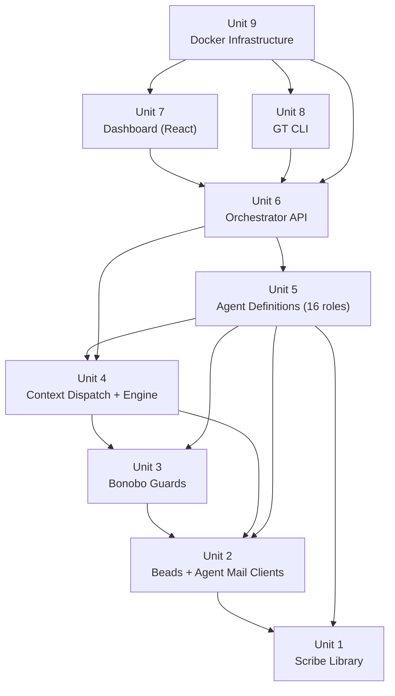

<!-- beads-issue: gt-9 -->
<!-- beads-review: gt-14 -->
# Units of Work -- Gorilla Troop

## Unit Decomposition Strategy

Units are ordered by dependency: foundational libraries first, then agents, then UI layers. Each unit produces a testable deliverable before the next depends on it.

---

## Unit 1: Scribe Tool Library

**Scope**: `orchestrator/lib/scribe/`

**Purpose**: Artifact management functions used by all Chimps. No LLM dependency. Foundation for all agent work.

**Deliverables**:
- `artifacts.py` -- create_artifact, validate_artifact, register_artifact, list_stage_artifacts
- `headers.py` -- parse/write cross-reference headers
- `outline_sync.py` -- wrapper for sync-outline.py push/pull
- Unit tests for all functions

**Dependencies**: None (uses existing Beads CLI and sync-outline.py)

**Construction Stages**: Functional Design, Code Generation, Build and Test
- NFR/Infra stages: SKIP (pure library, no infrastructure)

---

## Unit 2: Beads and Agent Mail Clients

**Scope**: `orchestrator/lib/beads/`, `orchestrator/lib/agent_mail/`

**Purpose**: Python wrappers around Beads CLI and Agent Mail HTTP API. Foundation for all agent communication.

**Deliverables**:
- `beads/client.py` -- Python wrapper: create, update, show, list, ready, dep, sync, close
- `agent_mail/client.py` -- HTTP client: send, receive, reserve_file, release_file, search
- Unit tests with mocked subprocess (Beads) and HTTP (Agent Mail)

**Dependencies**: Unit 1 (Scribe uses Beads client internally)

**Construction Stages**: Functional Design, Code Generation, Build and Test
- NFR/Infra stages: SKIP (library layer, infrastructure handled in Unit 8)

---

## Unit 3: Bonobo Write Guards

**Scope**: `orchestrator/lib/bonobo/`

**Purpose**: Privileged operation wrappers that validate and audit all writes.

**Deliverables**:
- `file_guard.py` -- validate paths, enforce directory conventions, audit writes
- `git_guard.py` -- branch management, commit with issue IDs, merge intelligence, conflict resolution
- `beads_guard.py` -- validate issue types, labels, dependency wiring
- Unit tests for each guard

**Dependencies**: Unit 2 (uses Beads client, Agent Mail for audit)

**Construction Stages**: Functional Design, Code Generation, Build and Test
- NFR Requirements: EXECUTE (security validation is core to Bonobo)
- NFR Design: SKIP (patterns are straightforward)
- Infra Design: SKIP (no separate infrastructure)

---

## Unit 4: Context Dispatch and Agent Engine

**Scope**: `orchestrator/lib/context/`, `orchestrator/engine/`

**Purpose**: The Context Dispatch Protocol and the agent lifecycle engine. Heart of the orchestrator.

**Deliverables**:
- `context/dispatch.py` -- DispatchMessage and CompletionMessage dataclasses, build/parse functions
- `engine/agent_engine.py` -- agent lifecycle: create, start, stop, spawn on demand
- `engine/project_registry.py` -- multi-project state: create, pause, resume, list
- `engine/notification_manager.py` -- notification queue with priority ordering
- Integration tests for engine lifecycle

**Dependencies**: Units 2, 3 (uses Beads, Agent Mail, Bonobo)

**Construction Stages**: Functional Design, Code Generation, Build and Test
- NFR Requirements: EXECUTE (reliability: crash recovery, state persistence)
- NFR Design: EXECUTE (patterns: event loop, coroutine management, graceful shutdown)
- Infra Design: SKIP (runs inside orchestrator container)

---

## Unit 5: Agent Definitions (All 16 Roles)

**Scope**: `orchestrator/agents/`

**Purpose**: Strands agent definitions with system prompts, tool bindings, and invocation contracts for all 16 roles.

**Deliverables**:
- `harmbe/agent.py`, `harmbe/prompt.md`, `harmbe/tools.py`
- `project_minder/agent.py`, `project_minder/prompt.md`, `project_minder/graph.py`, `project_minder/tools.py`
- `chimps/base_chimp.py` + 8 chimp subdirectories (scout, sage, bard, planner, architect, steward, forge, crucible), each with `agent.py`, `prompt.md`, `tools.py`
- `cross_cutting/bonobo/`, `cross_cutting/groomer/`, `cross_cutting/snake/`, `cross_cutting/curious_george/`, `cross_cutting/gibbon/` -- each with agent.py, prompt.md
- `troop/worker.py`
- Integration tests: dispatch a stage to Scout, verify artifact creation

**Dependencies**: Units 1-4 (agents use all libraries)

**Construction Stages**: All stages execute
- Functional Design: EXECUTE (complex agent behavior, prompt engineering)
- NFR Requirements: EXECUTE (security: Snake scanning pipeline)
- NFR Design: EXECUTE (patterns: agent retry, error escalation, rework chains)
- Infrastructure Design: SKIP (runs inside orchestrator container)
- Code Generation: EXECUTE
- Build and Test: EXECUTE

---

## Unit 6: Orchestrator API

**Scope**: `orchestrator/api/`

**Purpose**: FastAPI REST and WebSocket server consumed by the dashboard.

**Deliverables**:
- `api/app.py` -- FastAPI app factory
- `api/routes/projects.py` -- project CRUD + status
- `api/routes/chat.py` -- chat message handler
- `api/routes/review.py` -- review gate approve/reject
- `api/routes/notifications.py` -- notification list
- `api/routes/questions.py` -- Q&A answer handler
- `api/websocket.py` -- WebSocket event stream
- Integration tests for each endpoint

**Dependencies**: Unit 4 (uses AgentEngine), Unit 5 (invokes agents)

**Construction Stages**: Functional Design, Code Generation, Build and Test
- NFR Requirements: EXECUTE (performance: WebSocket latency, API response time)
- NFR Design: SKIP (standard FastAPI patterns)
- Infra Design: SKIP (runs inside orchestrator container)

---

## Unit 7: Harmbe Dashboard (Web UI)

**Scope**: `dashboard/`

**Purpose**: React web application -- the primary human interface.

**Deliverables**:
- Backend: `dashboard/backend/main.py` -- FastAPI proxy + static serving
- Frontend: React app with 5 panels (Chat, Document Review, Project Status, Notifications, Project Sidebar)
- `dashboard/frontend/src/components/` -- all UI components
- `dashboard/frontend/src/hooks/useWebSocket.ts` -- real-time event hook
- `dashboard/frontend/src/services/api.ts` -- REST client
- End-to-end test: create project, check status, approve review gate

**Dependencies**: Unit 6 (consumes orchestrator API)

**Construction Stages**: All stages execute
- Functional Design: EXECUTE (UI workflow design, panel interaction model)
- NFR Requirements: EXECUTE (usability, responsiveness)
- NFR Design: EXECUTE (React patterns: state management, WebSocket reconnection)
- Infrastructure Design: EXECUTE (Dockerfile, static asset serving)
- Code Generation: EXECUTE
- Build and Test: EXECUTE

---

## Unit 8: GT CLI

**Scope**: `cli/`

**Purpose**: Command-line interface for quick operations.

**Deliverables**:
- `cli/gt.py` -- Click or argparse CLI: status, projects, approve, pause, resume
- Unit tests for CLI argument parsing

**Dependencies**: Unit 6 (sends HTTP to orchestrator API)

**Construction Stages**: Functional Design, Code Generation, Build and Test
- NFR/Infra stages: SKIP (thin wrapper, trivial infrastructure)

---

## Unit 9: Docker Infrastructure

**Scope**: `infra/`

**Purpose**: Docker Compose configuration, Dockerfiles, networking, volume mounts.

**Deliverables**:
- `infra/docker-compose.yml` -- all 6 services
- `infra/Dockerfile.orchestrator` -- Python image with Strands SDK, bd CLI, project tools
- `infra/Dockerfile.dashboard` -- Node build + Python serving
- `infra/.env.example` -- all required environment variables
- Integration test: `docker compose up` starts all services healthy

**Dependencies**: Units 1-8 (packages everything)

**Construction Stages**:
- Functional Design: SKIP (no business logic)
- NFR Requirements: EXECUTE (reliability: health checks, restart policies, volume durability)
- NFR Design: EXECUTE (networking, security groups, credential mounting)
- Infrastructure Design: EXECUTE (Docker Compose spec, volume strategy, port mapping)
- Code Generation: EXECUTE (Dockerfiles, compose YAML)
- Build and Test: EXECUTE (compose up + health checks)

---

## Unit Dependency Graph

## Construction Stage Summary Per Unit

| Unit | FD | NFR-R | NFR-D | Infra-D | Code | B&T | Total |
|------|----|-------|-------|---------|------|-----|-------|
| 1. Scribe Library | X | - | - | - | X | X | 3 |
| 2. Beads + Mail Clients | X | - | - | - | X | X | 3 |
| 3. Bonobo Guards | X | X | - | - | X | X | 4 |
| 4. Context + Engine | X | X | X | - | X | X | 5 |
| 5. Agent Definitions | X | X | X | - | X | X | 5 |
| 6. Orchestrator API | X | X | - | - | X | X | 4 |
| 7. Dashboard | X | X | X | X | X | X | 6 |
| 8. GT CLI | X | - | - | - | X | X | 3 |
| 9. Docker Infra | - | X | X | X | X | X | 5 |
| **Totals** | **8** | **6** | **4** | **2** | **9** | **9** | **38** |

**Total Construction stages: 38** (plus review gates at each stage boundary)
