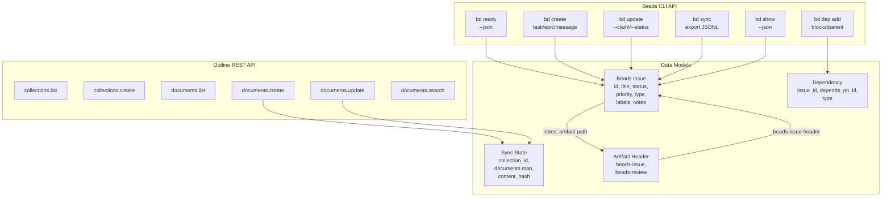
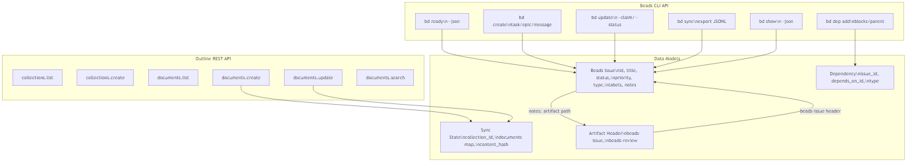

<!-- beads-issue: gt-15 -->
<!-- beads-review: gt-10 -->
# API Documentation

## API and Data Model Overview





## CLI APIs

### Beads CLI (`bd`)

The Beads CLI is the primary programmatic interface for all workflow operations. Full reference is in `AGENTS.md`.

#### Key Commands

| Command | Purpose |
|---------|---------|
| `bd init --prefix <prefix>` | Initialize Beads database |
| `bd ready --json` | Find unblocked work |
| `bd create "<title>" -t <type> -p <priority> [options]` | Create issue |
| `bd update <id> --claim` | Claim an issue (assign + in_progress) |
| `bd update <id> --status done --notes "<text>"` | Complete an issue |
| `bd show <id> --json` | View issue details |
| `bd dep add <blocked> <blocker>` | Add blocking dependency |
| `bd list [filters] --json` | List/filter issues |
| `bd sync` | Export database to JSONL |
| `bd close <id>` | Close an issue |
| `bd comments add <id> "<text>"` | Add comment |
| `bd doctor --fix` | Health check and auto-repair |

#### Issue Types
`task`, `epic`, `bug`, `feature`, `chore`, `decision`, `message`

#### Status Values
`open`, `in_progress`, `done`, `closed`

#### Priority Levels
`0` (critical/highest) through `4` (lowest), default `2`

### sync-outline.py CLI

```
Usage: python scripts/sync-outline.py <command>

Commands:
  init    - Initialize Outline collection and push all documents
  push    - Push local changes to Outline
  pull    - Pull Outline edits back to local files
  sync    - Full bidirectional sync
  status  - Show sync status
```

#### Environment Variables
- `OUTLINE_API_URL` - Outline API base URL (default: `http://localhost:3000`)
- `OUTLINE_API_KEY` - Outline API authentication key
- `OUTLINE_COLLECTION_NAME` - Target collection name (default: `AIDLC`)

### Initialization Scripts

```
# PowerShell
.\scripts\init-aidlc-project.ps1 [-ProjectType greenfield|brownfield]

# Bash
./scripts/init-aidlc-project.sh [greenfield|brownfield]
```

Both scripts:
1. Initialize Beads with prefix `ab-`
2. Create `aidlc-docs/` directory structure
3. Create phase epics (Inception, Construction, Operations)
4. Create inception stage issues with review gates
5. Wire dependency chain based on project type
6. Sync Beads database

## Internal APIs

### Outline REST API (used by sync-outline.py)

The sync script uses these Outline API endpoints:

#### Collections
- `POST /api/collections.list` - List collections
- `POST /api/collections.create` - Create a collection

#### Documents
- `POST /api/documents.list` - List documents in a collection
- `POST /api/documents.create` - Create a document
- `POST /api/documents.update` - Update document content
- `POST /api/documents.info` - Get document details
- `POST /api/documents.search` - Search documents

All requests use `Authorization: Bearer <API_KEY>` header.

## Data Models

### Beads Issue (from `.beads/issues.jsonl`)
- **id**: String - Unique identifier (e.g., `gt-15`)
- **title**: String - Issue title
- **description**: String - Detailed description
- **status**: Enum - `open` | `in_progress` | `done` | `closed`
- **priority**: Integer - 0-4
- **issue_type**: Enum - `task` | `epic` | `bug` | `feature` | `chore` | `decision` | `message`
- **owner**: String - Assignee email
- **labels**: Array of String - Categorization tags
- **notes**: String - Free-form notes (contains `artifact:` paths)
- **acceptance_criteria**: String - Definition of done
- **created_at**: ISO timestamp
- **updated_at**: ISO timestamp
- **dependencies**: Array of Dependency objects

### Beads Dependency
- **issue_id**: String - The dependent issue
- **depends_on_id**: String - The issue it depends on
- **type**: Enum - `blocks` | `tracks` | `related` | `parent` | `discovered-from` | `until` | `caused-by` | `validates` | `relates-to` | `supersedes`

### Outline Sync State (from `.beads/outline-sync-state.json`)
- **collection_id**: String - Outline collection UUID
- **documents**: Map of file path to document state
  - **document_id**: String - Outline document UUID
  - **content_hash**: String - MD5 hash of last synced content
  - **last_synced**: ISO timestamp

### Markdown Artifact Header
```markdown
<!-- beads-issue: <issue-id> -->
<!-- beads-review: <review-gate-id> -->
# Document Title
```
- **beads-issue**: Required - Links artifact to its stage issue
- **beads-review**: Required for reviewed artifacts - Links to review gate issue
