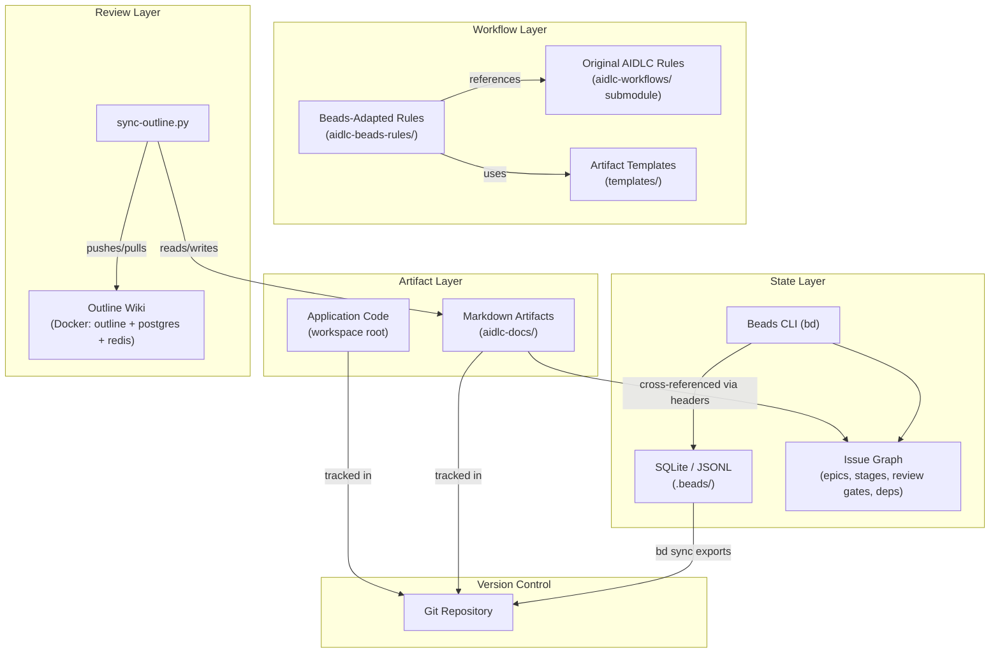
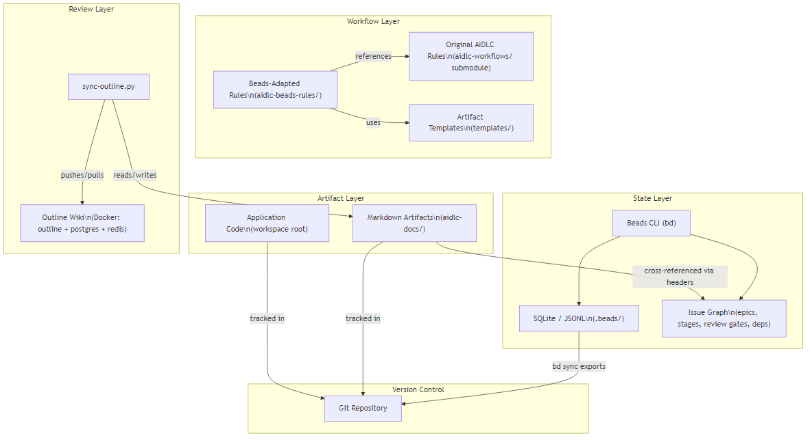
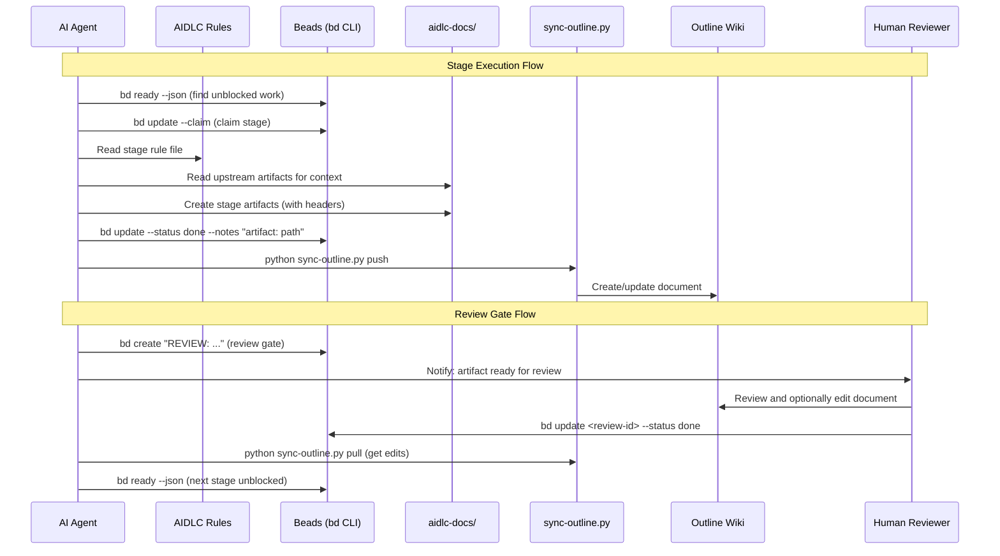

<!-- beads-issue: gt-15 -->
<!-- beads-review: gt-10 -->
# System Architecture

## System Overview

AIDLC-Beads is a template repository that provides the scaffolding for running AI-driven software development projects. It is not an application itself -- it is a framework of rules, scripts, templates, and infrastructure that AI agents follow to produce software with human oversight.

The system has three architectural layers:
1. **Workflow Layer**: AIDLC rules and Beads-adapted rules that define what AI agents do at each stage
2. **State Layer**: Beads issue tracker for workflow state, with JSONL export for Git portability
3. **Review Layer**: Outline Wiki for human-friendly document review, synced bidirectionally with Git-based markdown artifacts

## Architecture Diagram

## Component Descriptions

### Original AIDLC Rules (`aidlc-workflows/`)
- **Purpose**: Defines the complete AIDLC methodology -- all stages, their content, quality standards, and process
- **Dependencies**: None (standalone, imported as Git submodule)
- **Type**: Reference documentation (Git submodule)
- **Key files**: `aws-aidlc-rules/core-workflow.md` (orchestrator), `aws-aidlc-rule-details/` (per-stage details)

### Beads-Adapted Rules (`aidlc-beads-rules/`)
- **Purpose**: Wraps original AIDLC rules with Beads-specific integration instructions
- **Dependencies**: Original AIDLC rules (referenced, not duplicated)
- **Type**: Agent instruction files
- **Key files**: `common/beads-integration.md` (shared protocols), `inception/*.md` (per-stage rules)

### Beads Database (`.beads/`)
- **Purpose**: Stores workflow state -- issues, dependencies, events, metadata
- **Dependencies**: Beads CLI (`bd`)
- **Type**: Data store (SQLite + JSONL)
- **Key files**: `issues.jsonl` (Git-tracked export), `config.yaml` (configuration)

### Markdown Artifacts (`aidlc-docs/`)
- **Purpose**: Rich document artifacts produced by each AIDLC stage
- **Dependencies**: None (plain markdown)
- **Type**: Document store
- **Structure**: `inception/` (requirements, user stories, design) and `construction/` (per-unit design and code summaries)

### Outline Sync Script (`scripts/sync-outline.py`)
- **Purpose**: Bidirectional sync between Git markdown and Outline Wiki
- **Dependencies**: `requests`, `python-dotenv`, `pyyaml`, `rich` (via `scripts/requirements.txt`)
- **Type**: CLI tool (Python)
- **Key features**: Header preservation, content-hash change detection, sync state in `.beads/outline-sync-state.json`

### Initialization Scripts (`scripts/init-aidlc-project.*`)
- **Purpose**: Automated project setup
- **Dependencies**: Beads CLI (`bd`)
- **Type**: Shell scripts (PowerShell + Bash)
- **Creates**: Directory structure, phase epics, stage issues, review gates, dependency chain

### Outline Infrastructure (`outline/`)
- **Purpose**: Self-hosted wiki for document review
- **Dependencies**: Docker, PostgreSQL, Redis
- **Type**: Docker Compose service stack

## Data Flow

## Integration Points

- **Beads CLI (`bd`)**: Primary tool for workflow state management. Used by AI agents and humans.
- **Outline API**: RESTful API at `http://localhost:3000/api`. Used by sync-outline.py for document CRUD.
- **Git**: Version control for all artifacts and Beads JSONL export. Standard git operations.
- **AWS MCP Servers**: Configured in `.mcp.json` for AWS service integration (Bedrock, CDK, CloudWatch, etc.)

## Infrastructure Components

- **Outline Wiki**: Docker container (`docker.getoutline.com/outlinewiki/outline:latest`), port 3000
- **PostgreSQL 16**: Docker container (`postgres:16-alpine`), Outline database backend
- **Redis 7**: Docker container (`redis:7-alpine`), Outline session/cache store
- **No cloud infrastructure**: Currently a local-only system. Cloud deployment is not implemented.
