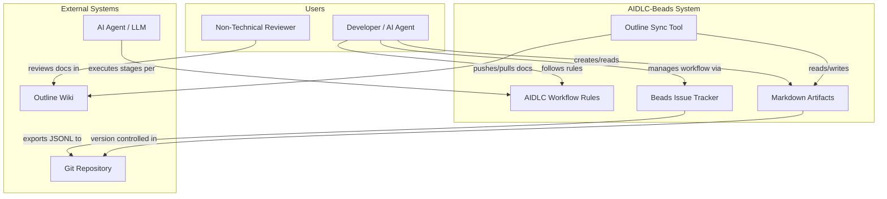
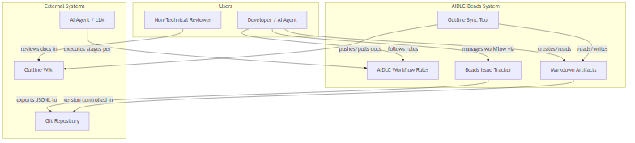

<!-- beads-issue: gt-15 -->
<!-- beads-review: gt-10 -->
# Business Overview

## Business Context Diagram

## Business Description

- **Business Description**: AIDLC-Beads is a workflow framework that orchestrates the AI-Driven Development Life Cycle (AIDLC). It provides a structured, stage-gated process for AI agents to produce software -- from requirements gathering through design, implementation, and testing -- with mandatory human review at every stage. The system replaces file-based state tracking (`aidlc-state.md`, `audit.md`) with Beads, a git-backed issue tracker, while keeping markdown as the primary format for rich document artifacts.

- **Business Transactions**:
  1. **Project Initialization**: Developer initializes a new AIDLC project, creating Beads database, phase epics, stage issues, and dependency chains
  2. **Stage Execution**: AI agent claims a stage, reads prior context, executes the stage rules, produces artifacts, and marks the stage complete
  3. **Human Review**: AI pushes artifacts to Outline; human reviews, edits, and approves or requests changes via Beads CLI
  4. **Question Resolution**: AI files a Q&A issue in Beads; human answers; AI incorporates the answer and continues
  5. **Conditional Stage Decision**: AI recommends whether to execute or skip a conditional stage; human approves or overrides
  6. **Session Continuity**: AI resumes a session by querying Beads for in-progress work, pulling Outline edits, and loading relevant artifacts

- **Business Dictionary**:
  - **AIDLC**: AI-Driven Development Life Cycle -- structured workflow for AI-assisted software development
  - **Beads**: Git-backed issue tracker used for workflow state management
  - **Stage**: A discrete step in the AIDLC workflow (e.g., Requirements Analysis, Code Generation)
  - **Review Gate**: A mandatory human approval checkpoint after each stage
  - **Artifact**: A markdown document produced by a stage (e.g., requirements.md, architecture.md)
  - **Epic**: A top-level grouping in Beads representing a phase (Inception, Construction, Operations)
  - **Cross-Reference**: The linking mechanism between Beads issues and markdown artifacts via HTML comments and notes fields
  - **Conditional Stage**: A stage that may be skipped based on project context (requires explicit user permission)
  - **Brownfield**: Existing codebase project (requires Reverse Engineering stage)
  - **Greenfield**: New project with no existing code

## Component-Level Business Descriptions

### AIDLC Workflow Rules (`aidlc-workflows/`)
- **Purpose**: Defines the content and process for each AIDLC stage -- what to analyze, what artifacts to produce, what quality standards to meet
- **Responsibilities**: Stage definitions, depth levels, content validation rules, question formats, error handling guidance

### Beads-Adapted Rules (`aidlc-beads-rules/`)
- **Purpose**: Extends the original AIDLC rules with Beads-specific workflow instructions -- how to manage issues, dependencies, and review gates
- **Responsibilities**: Session start/end protocols, stage claim/complete protocols, review gate handling, Q&A issue management, cross-reference maintenance

### Outline Sync Tool (`scripts/sync-outline.py`)
- **Purpose**: Bridges the gap between developer-friendly Git-based markdown and reviewer-friendly Outline Wiki
- **Responsibilities**: Bidirectional document sync, cross-reference header preservation, sync state management, collection/document lifecycle

### Initialization Scripts (`scripts/init-aidlc-project.*`)
- **Purpose**: Automates the creation of a complete AIDLC project structure with properly wired Beads issues
- **Responsibilities**: Beads initialization, directory creation, epic/stage/review-gate issue creation, dependency chain wiring

### Templates (`templates/`)
- **Purpose**: Ensures consistent artifact formatting across all stages
- **Responsibilities**: Cross-reference header format, document structure conventions

### Outline Infrastructure (`outline/`)
- **Purpose**: Provides a self-hosted wiki for non-technical reviewers to review and edit AIDLC artifacts
- **Responsibilities**: Docker Compose service definitions, environment configuration
