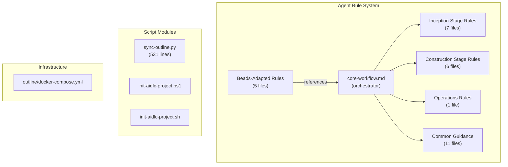
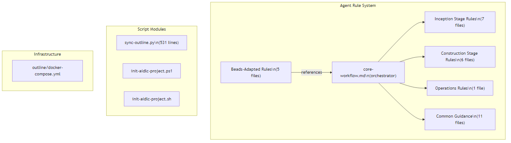

<!-- beads-issue: gt-15 -->
<!-- beads-review: gt-10 -->
# Code Structure

## Build System

- **Type**: None (no unified build system)
- **Configuration**: Individual scripts managed independently
  - Python: `scripts/requirements.txt` (pip)
  - Docker: `outline/docker-compose.yml` (Docker Compose)
  - Git submodule: `.gitmodules` (aidlc-workflows)
- **Build dependencies**: None between components

## Key Modules

## Existing Files Inventory

### Root Configuration
- `AGENTS.md` - Master agent instructions; 544 lines covering all Core Rules, CLI reference, and workflow patterns
- `README.md` - Project readme; 357 lines with architecture overview, prerequisites, and setup guide
- `LICENSE` - MIT License
- `.gitignore` - Exclusion rules for Beads DB, IDE configs, Python artifacts, Docker/Outline secrets
- `.gitmodules` - Git submodule definition for aidlc-workflows
- `.mcp.json` - MCP server configuration for 7 AWS services

### Scripts (`scripts/`)
- `sync-outline.py` - Primary utility script; 531 lines of Python implementing bidirectional Outline sync with:
  - `init` command: Creates Outline collection, pushes all docs
  - `push` command: Content-hash change detection, creates/updates documents
  - `pull` command: Fetches Outline edits, preserves cross-reference headers
  - `sync` command: Full bidirectional sync
  - `status` command: Shows sync state
  - State persistence in `.beads/outline-sync-state.json`
- `init-aidlc-project.ps1` - PowerShell initialization; creates Beads DB, epics, stages, review gates, dependencies
- `init-aidlc-project.sh` - Bash initialization; identical functionality to PowerShell version
- `requirements.txt` - Python dependencies (requests, python-dotenv, pyyaml, rich)

### Beads-Adapted Rules (`aidlc-beads-rules/`)
- `common/beads-integration.md` - Session start/end, stage execution, review gate, Q&A, cross-reference, conditional stage, and error handling protocols
- `common/session-continuity-beads.md` - Session resume protocol (Beads query, Outline pull, artifact loading)
- `inception/workspace-detection-beads.md` - Workspace detection with Beads initialization, project scanning, epic creation, dependency wiring
- `inception/requirements-analysis-beads.md` - Requirements analysis with Beads claim/complete, depth determination, Q&A via Beads issues
- `inception/workflow-planning-beads.md` - Workflow planning with scope analysis, phase determination, conditional stage wiring

### Templates (`templates/`)
- `artifact-header.md` - Cross-reference header template showing format and examples for different artifact types

### Design Documents (`docs/design/`)
- `architecture-c-detailed-design.md` - Hybrid architecture design with Beads schema mapping and state migration
- `beads-schema-mapping.md` - Issue templates for all AIDLC phases and stages, plus label taxonomy
- `cross-reference-contract.md` - Bidirectional linking rules between Beads issues and markdown artifacts
- `human-interaction-guide.md` - How humans review, approve, answer questions, and override decisions
- `outline-integration.md` - Outline setup, architecture, sync mechanisms, conflict resolution
- `gorilla-troop-architecture.md` - Multi-agent system design for Gorilla Troop (16 agents + Scribe tool library)

### Infrastructure (`outline/`)
- `docker-compose.yml` - Three-service stack: outline (port 3000), postgres (16-alpine), redis (7-alpine)
- `.env.example` - Environment template with secrets, auth options, and AIDLC sync config

## Design Patterns

### Cross-Reference Pattern
- **Location**: All markdown artifacts + Beads issue notes
- **Purpose**: Maintains traceability between workflow state and document content
- **Implementation**: HTML comments (`<!-- beads-issue: ... -->`) in markdown headers + `artifact: <path>` in Beads issue notes

### Rule Layering Pattern
- **Location**: `aidlc-beads-rules/` referencing `aidlc-workflows/`
- **Purpose**: Separates content concerns (what to produce) from workflow concerns (how to track state)
- **Implementation**: Beads-adapted rules wrap original AIDLC rules, adding Beads CLI commands at each step

### Bidirectional Sync Pattern
- **Location**: `scripts/sync-outline.py`
- **Purpose**: Keeps two representations (Git markdown + Outline wiki) in sync
- **Implementation**: Content-hash change detection, header preservation through round-trips, state file for tracking

### Dependency Chain Pattern
- **Location**: Beads issue graph (via `bd dep add`)
- **Purpose**: Enforces stage ordering and review gates
- **Implementation**: `blocks` dependencies between stages and review gates, `parent` dependencies to epics

## Critical Dependencies

### Beads CLI (`bd`)
- **Version**: Latest (installed externally)
- **Usage**: All workflow state management -- creating issues, updating status, managing dependencies, syncing exports
- **Purpose**: Replaces file-based state tracking with git-backed issue tracker

### Git (+ aidlc-workflows submodule)
- **Version**: 2.x+
- **Usage**: Version control, submodule for original AIDLC rules
- **Purpose**: Source of truth for all artifacts, rules, and Beads JSONL exports

### Outline Wiki
- **Version**: Latest Docker image
- **Usage**: Human review surface for non-technical reviewers
- **Purpose**: Provides WYSIWYG editing and review of markdown artifacts

### Docker / Docker Compose
- **Version**: Docker 20+, Compose v2
- **Usage**: Hosts Outline Wiki stack (outline + postgres + redis)
- **Purpose**: Self-contained review infrastructure
