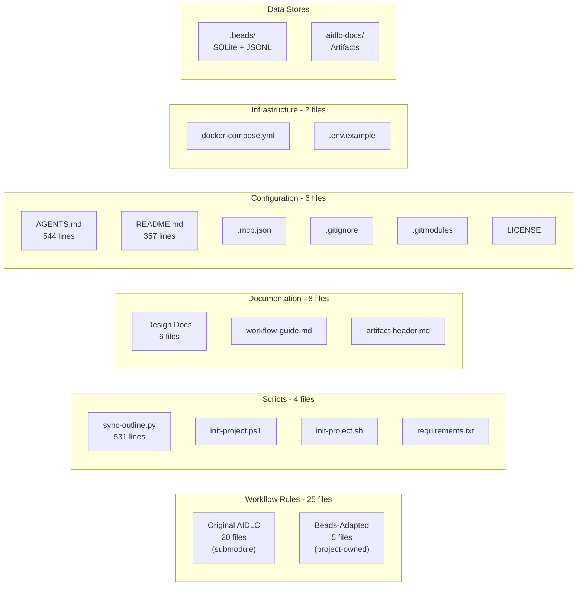
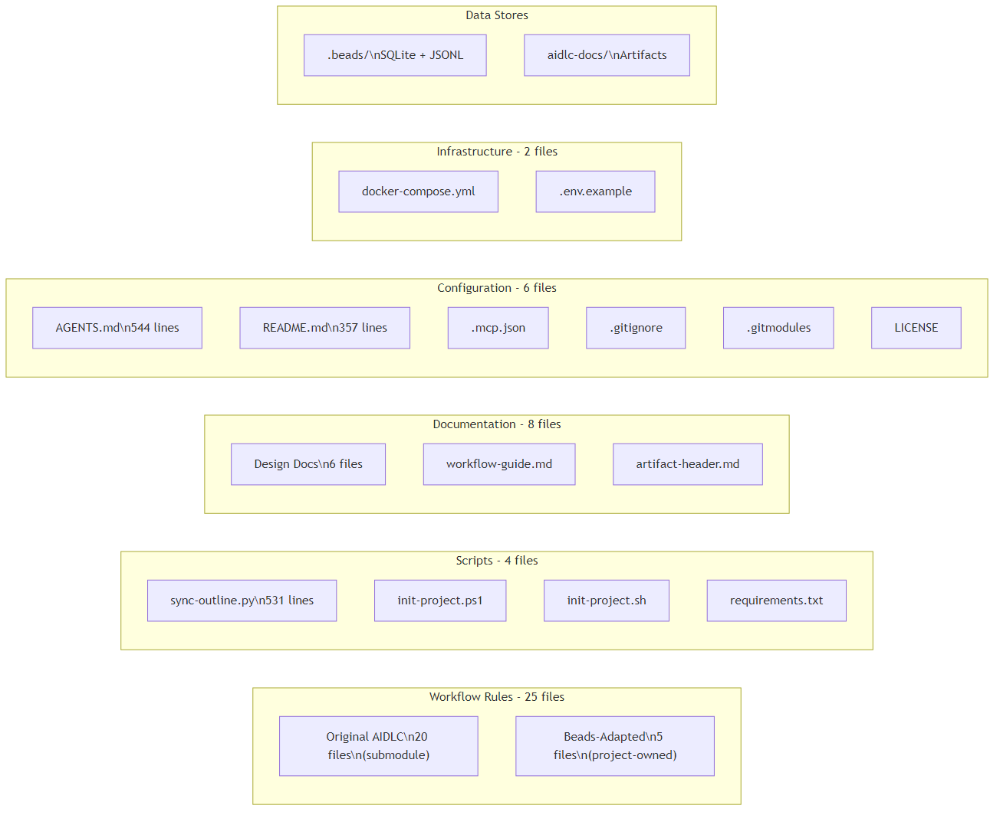

<!-- beads-issue: gt-15 -->
<!-- beads-review: gt-10 -->
# Component Inventory

## Component Category Overview

## Workflow Rule Packages

- `aidlc-workflows/` - Original AIDLC rules (Git submodule from awslabs/aidlc-workflows)
  - `aidlc-rules/aws-aidlc-rules/core-workflow.md` - Main orchestrator
  - `aidlc-rules/aws-aidlc-rule-details/common/` - 11 shared guidance files
  - `aidlc-rules/aws-aidlc-rule-details/inception/` - 7 inception stage rules
  - `aidlc-rules/aws-aidlc-rule-details/construction/` - 6 construction stage rules
  - `aidlc-rules/aws-aidlc-rule-details/operations/` - 1 operations rule

- `aidlc-beads-rules/` - Beads-adapted rules (project-owned)
  - `common/beads-integration.md` - Shared Beads integration protocols
  - `common/session-continuity-beads.md` - Session resume/end protocols
  - `inception/workspace-detection-beads.md` - Workspace detection with Beads
  - `inception/requirements-analysis-beads.md` - Requirements with Beads
  - `inception/workflow-planning-beads.md` - Workflow planning with Beads

## Script Packages

- `scripts/sync-outline.py` - Outline bidirectional sync tool (531 lines, Python)
- `scripts/init-aidlc-project.ps1` - Project initialization (PowerShell)
- `scripts/init-aidlc-project.sh` - Project initialization (Bash)
- `scripts/requirements.txt` - Python dependencies for sync script

## Infrastructure Packages

- `outline/docker-compose.yml` - Outline Wiki Docker Compose stack
- `outline/.env.example` - Outline environment configuration template

## Template Packages

- `templates/artifact-header.md` - Cross-reference header template with examples

## Documentation Packages

- `docs/design/architecture-c-detailed-design.md` - Beads architecture design
- `docs/design/beads-schema-mapping.md` - Issue schema templates
- `docs/design/cross-reference-contract.md` - Linking conventions
- `docs/design/human-interaction-guide.md` - Human workflow patterns
- `docs/design/outline-integration.md` - Outline setup and architecture
- `docs/design/gorilla-troop-architecture.md` - Gorilla Troop multi-agent architecture
- `docs/workflow-guide.md` - User-facing workflow guide

## Configuration Files

- `.gitignore` - Git exclusion rules
- `.gitmodules` - Submodule reference (aidlc-workflows)
- `.mcp.json` - MCP server configuration (7 AWS MCP servers)
- `AGENTS.md` - Agent instructions and Beads CLI reference (544 lines)
- `README.md` - Project overview and setup guide (357 lines)
- `LICENSE` - MIT License

## Data Stores

- `.beads/` - Beads database directory
  - `issues.jsonl` - Git-tracked issue export (source of truth for portability)
  - `config.yaml` - Beads configuration
  - `metadata.json` - Database metadata

## Total Count

- **Total Rule Files**: ~25 (5 beads-adapted + ~20 original AIDLC)
- **Scripts**: 4 (1 Python, 1 PowerShell, 1 Bash, 1 requirements.txt)
- **Infrastructure**: 2 (Docker Compose + env template)
- **Design Docs**: 6
- **Templates**: 1
- **Config Files**: 6
