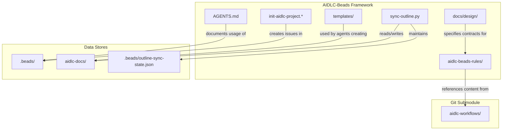
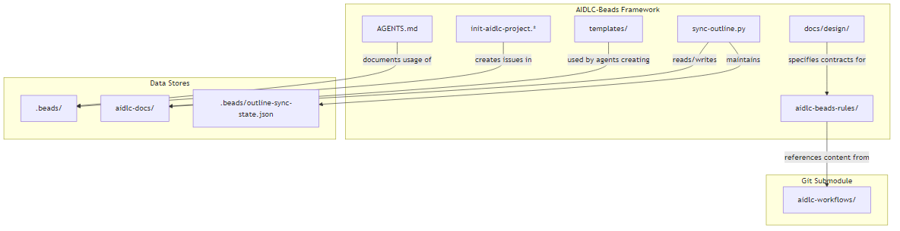

<!-- beads-issue: gt-15 -->
<!-- beads-review: gt-10 -->
# Dependencies

## Internal Dependencies

### aidlc-beads-rules/ depends on aidlc-workflows/
- **Type**: Reference (Git submodule)
- **Reason**: Beads-adapted rules reference original AIDLC rules for content guidance. They add Beads integration steps without duplicating the original instructions.

### sync-outline.py depends on aidlc-docs/
- **Type**: Runtime
- **Reason**: Reads markdown files from aidlc-docs/ to push to Outline, writes back edits from Outline.

### sync-outline.py depends on .beads/outline-sync-state.json
- **Type**: Runtime
- **Reason**: Tracks which documents have been synced, their content hashes, and Outline document IDs.

### init-aidlc-project.* depends on .beads/
- **Type**: Runtime
- **Reason**: Uses Beads CLI to create issues, wire dependencies, and export to JSONL.

### aidlc-docs/ artifacts depend on .beads/ issues
- **Type**: Logical (cross-reference)
- **Reason**: Each markdown artifact contains HTML comment headers referencing its Beads issue and review gate IDs.

## External Dependencies

### Beads CLI (`bd`)
- **Version**: Latest
- **Purpose**: Git-backed issue tracking CLI
- **License**: Open source
- **Installation**: External (not bundled)
- **Required by**: All workflow operations, initialization scripts, agent rules

### Git
- **Version**: 2.x+
- **Purpose**: Version control, submodule management
- **License**: GPL-2.0
- **Required by**: Everything (source of truth for all files)

### Docker + Docker Compose
- **Version**: Docker 20+, Compose v2
- **Purpose**: Container runtime for Outline stack
- **License**: Apache 2.0
- **Required by**: Outline Wiki deployment

### Python 3
- **Version**: 3.8+
- **Purpose**: Runtime for sync-outline.py
- **License**: PSF
- **Required by**: Outline sync operations

### Python Libraries (via pip)
- **requests** >= 2.31.0 - HTTP client (Apache 2.0)
- **python-dotenv** >= 1.0.0 - .env file loading (BSD)
- **pyyaml** >= 6.0 - YAML parsing (MIT)
- **rich** >= 13.0.0 - Terminal formatting (MIT)

### Outline Wiki
- **Version**: Latest Docker image (`docker.getoutline.com/outlinewiki/outline:latest`)
- **Purpose**: WYSIWYG document review UI
- **License**: BSL 1.1
- **Required by**: Human review workflow

### PostgreSQL 16
- **Version**: 16 (Alpine)
- **Purpose**: Outline database backend
- **License**: PostgreSQL License
- **Required by**: Outline Wiki

### Redis 7
- **Version**: 7 (Alpine)
- **Purpose**: Outline session/cache store
- **License**: Redis Source Available License
- **Required by**: Outline Wiki

### AWS MCP Servers (via .mcp.json)
- **Version**: Latest (via uvx)
- **Purpose**: AWS service integration for agents (Bedrock, CDK, CloudWatch, etc.)
- **License**: Apache 2.0 (awslabs)
- **Required by**: AI agents needing AWS capabilities
