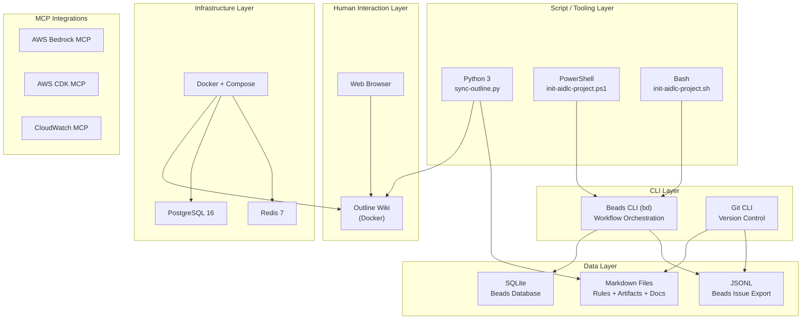
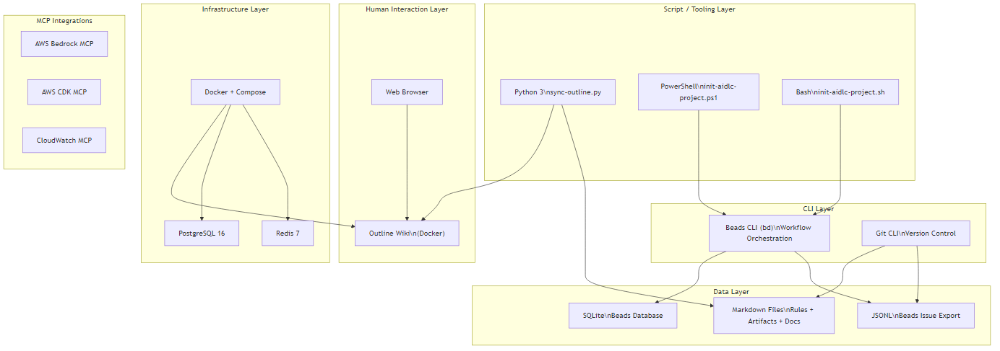

<!-- beads-issue: gt-15 -->
<!-- beads-review: gt-10 -->
# Technology Stack

## Technology Stack Overview

## Programming Languages

- **Python** - 3.x - Outline sync script (`sync-outline.py`)
- **PowerShell** - 5.1+ - Windows initialization script (`init-aidlc-project.ps1`)
- **Bash** - 4+ - Linux/macOS initialization script (`init-aidlc-project.sh`)
- **Markdown** - N/A - All documentation, rules, artifacts, and agent instructions

## Frameworks

- None. This is a workflow framework, not an application. No web frameworks, no application frameworks.

## Infrastructure

- **Docker** - Container runtime for Outline Wiki stack
- **Docker Compose** - Service orchestration for Outline (outline + postgres + redis)
- **Outline Wiki** - Self-hosted wiki for document review (latest image)
- **PostgreSQL 16** - Database backend for Outline (Alpine variant)
- **Redis 7** - Cache/session store for Outline (Alpine variant)

## CLI Tools

- **Beads (`bd`)** - Git-backed issue tracker CLI. Primary workflow orchestration tool.
- **Git** - Version control for artifacts and Beads JSONL export
- **Python** - Runtime for sync-outline.py

## Python Dependencies (scripts/requirements.txt)

- **requests** >= 2.31.0 - HTTP client for Outline API
- **python-dotenv** >= 1.0.0 - Environment variable management (.env files)
- **pyyaml** >= 6.0 - YAML parsing support
- **rich** >= 13.0.0 - Terminal output formatting (colored tables, progress bars)

## MCP Servers (configured in .mcp.json)

- **awslabs.core-mcp-server** - Core AWS MCP tools
- **awslabs.aws-api-mcp-server** - AWS API operations
- **aws-knowledge-mcp-server** - AWS documentation and knowledge
- **awslabs.cdk-mcp-server** - AWS CDK operations
- **awslabs.aws-diagram-mcp-server** - AWS architecture diagrams
- **awslabs.aws-pricing-mcp-server** - AWS pricing queries
- **awslabs.cloudwatch-mcp-server** - CloudWatch monitoring

## Build Tools

- **pip** - Python package installer (via requirements.txt)
- No build system for the framework itself -- it is a collection of markdown, scripts, and Docker configs

## Testing Tools

- None. No test suite exists for this codebase.
