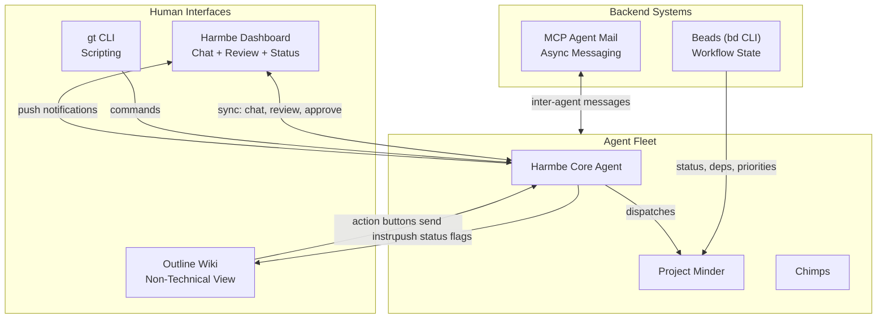
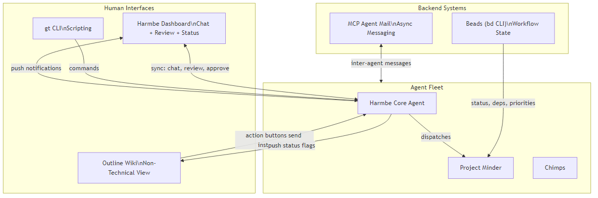
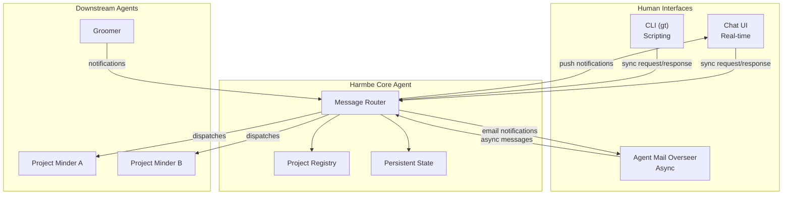
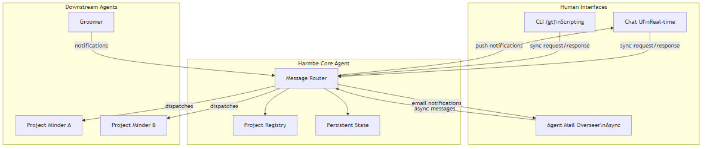
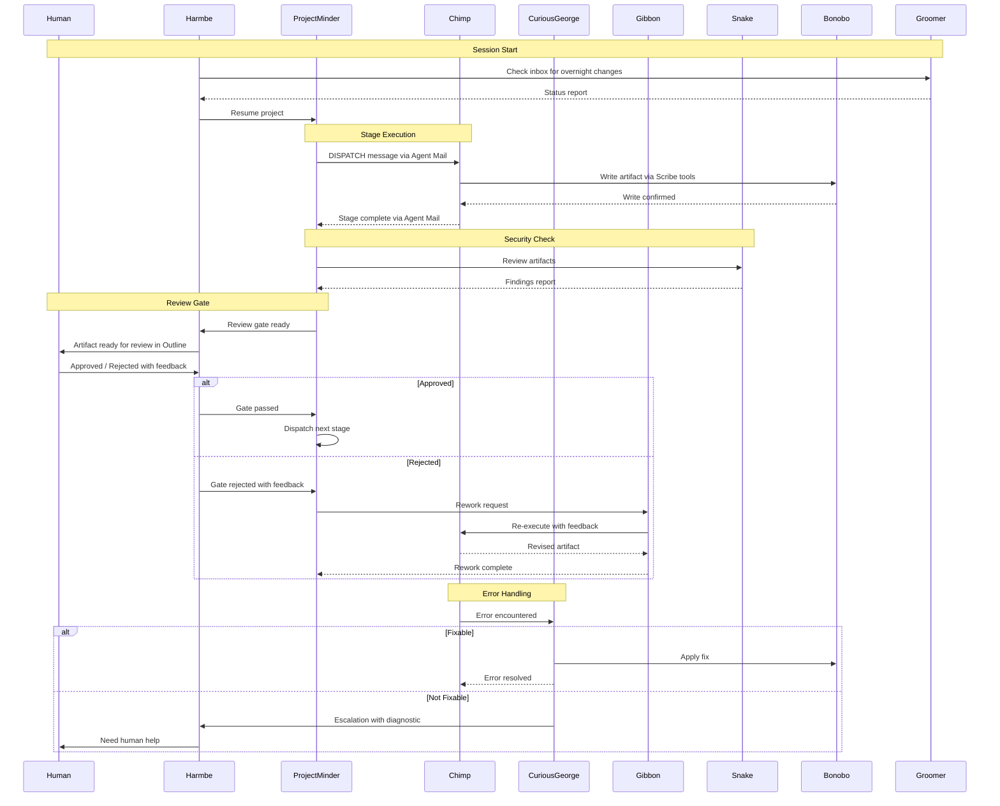
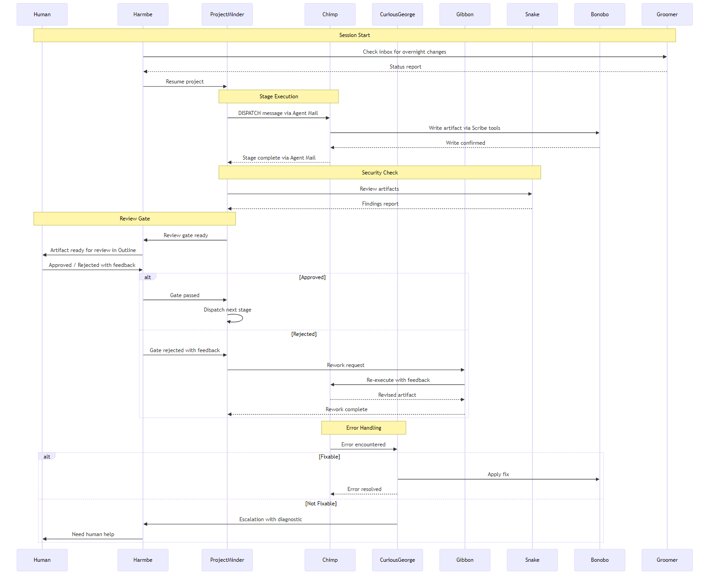
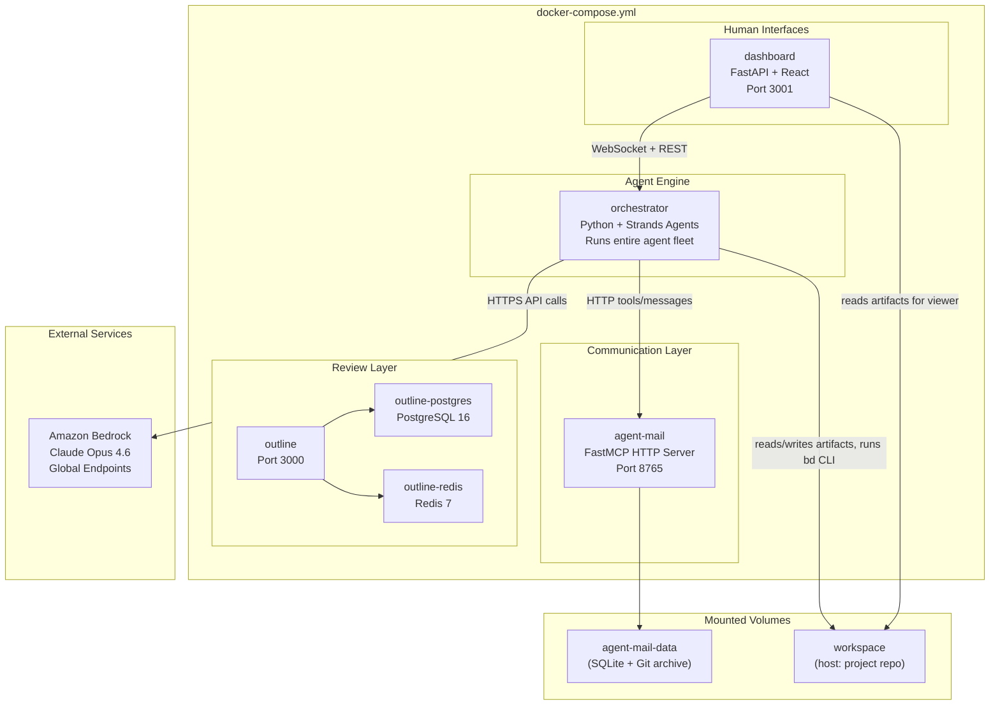
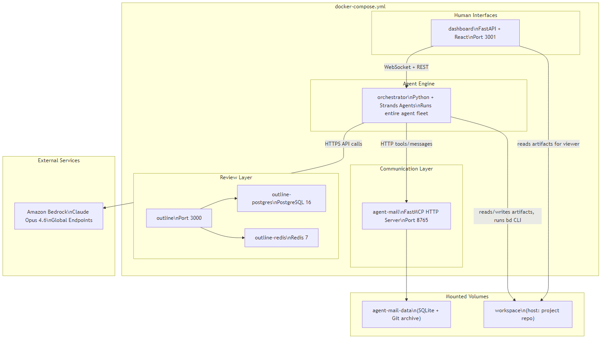
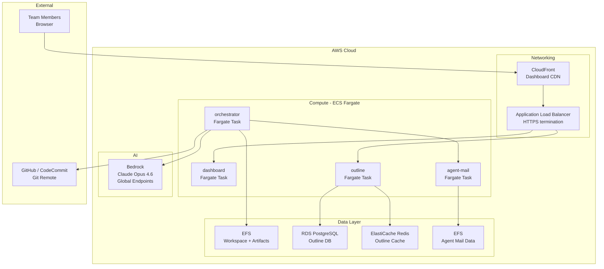
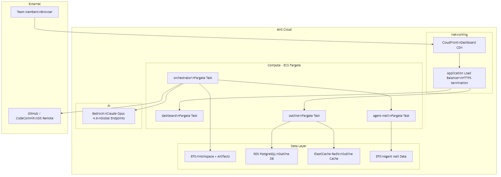

# Gorilla Troop V2 -- Revised Multi-Agent Architecture

<!-- beads-issue: TBD -->
<!-- beads-review: TBD -->

> System Name: **Gorilla Troop**
> Framework: [Strands Agents](https://strandsagents.com/latest/) on Amazon Bedrock
> Default Model: Anthropic Claude Opus 4.6 (Bedrock Global Endpoints)

## Communication and UI Infrastructure

Four systems form the coordination backbone. Each has a distinct role:





- **Beads** = source of truth for workflow state (issue status, dependencies, priorities)
- **MCP Agent Mail** = async messaging between agents and between humans and agents. Thread IDs map to Beads issue IDs (`ab-XXXX.N`). File reservations prevent artifact conflicts.
- **Harmbe Dashboard** (primary human interface) = full project command center. See below.
- **Outline Wiki** (secondary human interface) = non-technical-friendly document view. See below.

### Harmbe Dashboard (Primary Human Interface)

The Harmbe Dashboard is the **command center** for humans interacting with the Gorilla Troop. It is a web application with Harmbe as the intelligent agent powering it.

**Panels:**

- **Chat Panel**: Conversational interface with Harmbe. Ask questions, give instructions, receive explanations. Real-time, synchronous.
- **Document Review Panel**: Inline markdown viewer/editor for AIDLC artifacts. When a review gate is triggered, the artifact appears here with approve/reject/request-changes controls and a feedback text area. No need to leave the dashboard.
- **Project Status Panel**: Visual overview of the AIDLC dependency graph. Shows current stage, completed stages, blocked stages, pending review gates. Driven by Beads state and `bv --robot-insights`.
- **Notification Center**: Prioritized list of items needing human attention. Review gates, Q&A questions, escalations, stage completions. Badge counts on each category. Clicking a notification navigates to the relevant panel.
- **Multi-Project Sidebar**: List of all active projects with status indicators (green = progressing, yellow = waiting for human, red = error/escalation). Click to switch project context.

**Review workflow in the dashboard:**

1. Notification appears: "Review gate ready: Requirements Analysis"
2. Human clicks notification -> Document Review Panel opens with `requirements.md`
3. Human reads, optionally edits inline
4. Human clicks "Approve" or "Request Changes" (with feedback text)
5. Harmbe routes the decision to Project Minder, updates Beads, dispatches next stage or Gibbon rework
6. All in one interface, no tool switching

### Outline Wiki (Secondary Interface for Non-Technical Users)

Outline remains in the stack but evolves from a passive review surface to an **active participant** with status awareness and action buttons.

**Enhancements to Outline integration:**

- **Review status flags**: Each document in Outline shows its review status prominently: "Draft", "Awaiting Review", "In Review", "Approved", "Changes Requested", "Rework In Progress". Synced from Beads issue state.
- **Action buttons** (via Outline API/plugins or embedded controls):
  - "Done Editing" -- sends a message to Harmbe: "Document X has been edited in Outline, ready for re-review"
  - "Approve" / "Request Changes" -- sends approval/rejection to Harmbe via Agent Mail, with an optional feedback field
  - "Ask Harmbe" -- opens a simple form to send a question to Harmbe about this document
- **Who uses Outline**: Non-technical reviewers (product owners, stakeholders) who prefer a clean wiki-style interface over the full developer dashboard. They see the same documents, can edit them, and their actions flow through Harmbe just like dashboard actions.
- **Sync flow**: `sync-outline.py` is enhanced to push review status metadata alongside document content, and to relay Outline action-button events to Harmbe via Agent Mail.

**Relationship between Dashboard and Outline**: Both are views into the same data. Edits in Outline are pulled by Harmbe before review. Edits in the Dashboard are pushed to Outline. Neither is the source of truth -- Git files in `aidlc-docs/` remain canonical. The Dashboard is the power-user interface; Outline is the accessible alternative.

---

## Full Agent Roster

### Tier 1: Orchestration

#### 1. Harmbe (Silverback) -- Human Interface and Session Orchestrator

- **Strands pattern**: Agents as Tools (top-level orchestrator)
- **Model**: Claude Opus 4.6 (Bedrock Global)
- **Agent Mail identity**: `Harmbe`
- **Architecture**: Multi-channel hybrid agent with persistent state

##### Interaction Model

Harmbe is a **persistent, multi-channel agent** that humans reach through multiple interfaces. The same agent state is shared across all channels.

**Channels:**

- **Chat UI** (web-based): Primary real-time interface. Conversational, synchronous. For decisions, status checks, project creation, and interactive Q&A. Think ChatGPT-style but project-aware.
- **Agent Mail** (async): For background notifications. When a stage completes, a review gate is ready, or an escalation needs attention, Harmbe sends a message that the human reads when they return. The MCP Agent Mail Human Overseer web UI also lets humans send high-priority messages to Harmbe at any time.
- **CLI** (`gorilla` or `gt` command): For scripting and quick commands. `gt status`, `gt projects`, `gt approve ab-0042.3`, `gt pause project-x`. Thin wrapper that sends a structured message to Harmbe and prints the response.

**Interaction modes:**

- **Synchronous** (Chat UI, CLI): Human asks, Harmbe responds immediately. Used for decisions, status queries, project creation, approvals.
- **Asynchronous** (Agent Mail, push notifications): Harmbe works in the background. When it needs the human (review gate, Q&A, escalation), it sends a notification via Agent Mail. When a stage completes, it logs progress. Human comes back when convenient.

**Persistence**: Harmbe's state survives across sessions. Project registry, conversation history, and pending notifications persist in Agent Mail threads and Beads. When the human returns after hours/days, Harmbe reconstructs context from Groomer's session-resume report.





##### Human-Facing Command Surface

What humans ask Harmbe to do (via any channel):

- **Project creation**: "Start a new project for X" -- Harmbe gathers initial info (name, greenfield/brownfield, workspace path), spawns a Project Minder, triggers Workspace Detection via Scout
- **Project status**: "Where are we on project X?" -- Harmbe queries Beads (`bd list --pretty`, `bd ready --json`, `bv --robot-insights`) and presents a human-friendly summary: current stage, blockers, pending review gates, progress percentage
- **Multi-project dashboard**: "Show me all projects" -- Harmbe lists all active Project Minder instances with status summaries, highlights which projects need human attention (pending reviews, unanswered Q&As)
- **Review decisions**: "I approve the requirements doc" / "Reject with feedback: ..." -- Harmbe routes to Project Minder, which updates Beads and dispatches next stage (or triggers Gibbon rework)
- **Q&A answers**: "Go with option B" -- Harmbe resolves the Q&A issue in Beads and notifies the blocked agent
- **Skip approvals**: "Yes, skip user stories" / "No, execute it" -- Harmbe records the decision and notifies Project Minder
- **Priority changes**: "Drop everything and focus on security" -- Harmbe sends high-priority Agent Mail message to Project Minder, which re-evaluates the execution plan
- **Pause/resume**: "Pause project X" / "Resume project X" -- Harmbe suspends or resumes the Project Minder, persisting state via Beads and Agent Mail
- **Ad-hoc questions**: "What did we decide about authentication?" -- Harmbe searches Agent Mail threads and Beads history, returns relevant context
- **Escalation responses**: "Here's how to fix that error: ..." -- Harmbe routes human guidance to the Curious George or agent that escalated

##### Core Responsibilities

- Sole point of contact for human users across all channels
- Project registry: maintains a list of active projects, their workspace paths, and their Project Minder instances (persisted in Agent Mail and/or a local config)
- Session lifecycle: on human connect, requests Groomer's status report; on disconnect, ensures Beads and Agent Mail state are consistent
- Routes human decisions to the correct downstream agent: review approvals, Q&A answers, skip permissions
- Translates between human-friendly language and AIDLC formal protocols
- Escalation handler: when any agent encounters an unrecoverable error, it bubbles to Harmbe via Agent Mail; Harmbe presents it to the human on next interaction
- Background notification management: queues notifications for the human, deduplicates, prioritizes (review gates > escalations > status updates > informational)
- **Does NOT**: Execute any AIDLC stage, create artifacts, invoke OS tools directly (except Beads queries for status)

#### 2. Project Minder (Beta Ape) -- AIDLC Graph Controller

- **Strands pattern**: Graph (AIDLC stage dependency graph with conditional edges)
- **Model**: Claude Opus 4.6 (Bedrock Global)
- **Agent Mail identity**: `ProjectMinder`
- **Responsibilities**:
  - Owns the AIDLC dependency graph for a single project
  - Determines stage execution order via Beads state (`bd ready`, `bd blocked`, `bv --robot-priority`)
  - Executes Workflow Planning (Stage 5) directly -- this meta-stage determines which Construction stages run
  - Dispatches stage execution to Chimps via Agent Mail messages with the **Context Dispatch Protocol** (see below)
  - Manages the per-unit Construction loop: iterates units, dispatches design and code stages for each
  - Enforces review gate protocol: creates review gate issue, messages Harmbe to notify human, waits for approval message before dispatching next stage
  - Handles conditional stage skip recommendations: analyzes whether to skip, formulates recommendation, routes to Harmbe for human approval
  - Files Agent Mail file reservations for artifact directories before dispatching a Chimp
  - Tracks overall project progress; reports status to Harmbe on request
- **Does NOT**: Create artifacts, interact with humans directly, execute tools beyond Beads queries

---

### Tier 2: Stage Specialists (Chimps)

All Chimps follow the same contract:

- **Strands pattern**: Agents as Tools (invoked by Project Minder)
- **Model**: Claude Opus 4.6 (Bedrock Global) -- all Chimps
- **On dispatch**: Receive a Context Dispatch Message from Project Minder via Agent Mail containing stage instructions, Beads issue references, and artifact paths to load
- **On completion**: Send a completion message to Project Minder via Agent Mail with artifact paths, status summary, and any discovered work
- **On error**: Send error details to a Curious George for investigation
- **Artifact creation**: Use the Scribe tool library (not an agent) for headers, paths, cross-references

#### 3. Scout -- Codebase Comprehension

- **Stages**: Workspace Detection (1), Reverse Engineering (2)
- **Skills**: File system analysis, language/framework detection, architecture recovery, codebase mapping, build system identification
- **Tools**: File system scanning, code parsers, Beads CLI, Scribe tool library
- **Artifacts**: Workspace analysis notes, business-overview.md, architecture.md, code-structure.md, api-documentation.md, component-inventory.md, technology-stack.md, dependencies.md, code-quality-assessment.md

#### 4. Sage -- Requirements Analyst

- **Stage**: Requirements Analysis (3)
- **Skills**: Requirements elicitation, stakeholder analysis, ambiguity/contradiction detection, depth calibration (minimal/standard/comprehensive), product owner mindset
- **Tools**: Beads Q&A creation, Scribe tool library
- **Artifacts**: requirement-verification-questions.md, requirements.md

#### 5. Bard -- Story Author

- **Stage**: User Stories (4)
- **Skills**: Persona development, user story authoring (INVEST criteria), acceptance criteria definition, story breakdown strategies (journey/feature/persona/domain/epic-based)
- **Tools**: Beads CLI, Scribe tool library
- **Artifacts**: story-generation-plan.md, stories.md, personas.md

#### 6. Planner -- Execution Strategist

- **Stages**: Workflow Planning (5), Units Generation (7)
- **Skills**: Scope and impact analysis, risk assessment, stage recommendation logic, system decomposition, unit boundary definition, dependency mapping
- **Tools**: Beads CLI (dependency graph management), Scribe tool library
- **Artifacts**: execution-plan.md, unit-of-work.md, unit-of-work-dependency.md, unit-of-work-story-map.md
- **Note**: Works closely with Project Minder -- Planner produces the execution plan, Project Minder enforces it

#### 7. Architect -- System Designer

- **Stage**: Application Design (6)
- **Skills**: Component design, service orchestration, interface design, dependency mapping, Mermaid diagramming
- **Tools**: Beads CLI, Scribe tool library
- **Artifacts**: components.md, component-methods.md, services.md, component-dependency.md, application-design-plan.md

#### 8. Steward -- Quality Attributes Engineer

- **Stages**: NFR Requirements (9), NFR Design (10), Infrastructure Design (11)
- **Skills**: NFR analysis (scalability, performance, availability, security), design pattern application (resilience, caching, circuit-breaker), cloud architecture (AWS/Azure/GCP), deployment architecture, IaC
- **Tools**: Beads CLI, Scribe tool library
- **Artifacts**: nfr-requirements.md, tech-stack-decisions.md, nfr-design-patterns.md, logical-components.md, infrastructure-design.md, deployment-architecture.md, shared-infrastructure.md
- **Note**: Groups all "how well does it work" concerns. NFR requirements, NFR design patterns, and infrastructure mapping are a coherent arc from quality goals to operational reality.

#### 9. Forge -- Domain Modeler and Code Author

- **Stages**: Functional Design (8), Code Generation (12)
- **Skills**: Domain modeling, business rule definition, data flow design, code generation (multi-language), unit test generation, API implementation, database migration authoring
- **Tools**: Beads CLI, Scribe tool library, file system writes (via Bonobo), linters, formatters
- **Artifacts**: business-logic-model.md, business-rules.md, domain-entities.md, frontend-components.md, code-generation-plan.md, application code, unit tests, migrations
- **Note**: Functional design feeds directly into code generation. Same agent retains domain context across both stages, reducing handoff loss.

#### 10. Crucible -- Build and Test Specialist

- **Stage**: Build and Test (13)
- **Skills**: Build system execution, test strategy, unit/integration/E2E/performance/contract/security testing, CI/CD pipeline design
- **Tools**: Build systems (npm, maven, etc.), test runners, Beads CLI, Scribe tool library
- **Artifacts**: build-instructions.md, unit-test-instructions.md, integration-test-instructions.md, performance-test-instructions.md, security-test-instructions.md, e2e-test-instructions.md, build-and-test-summary.md

---

### Tier 3: Cross-Cutting Roles

#### 11. Bonobo -- Privileged Operation Guardian

- **Strands pattern**: Tool execution layer (wraps dangerous operations)
- **Model**: Claude Opus 4.6 (Bedrock Global)
- **Responsibilities**:
  - Guards and executes all write operations: filesystem writes, git commits, Beads state mutations (`bd create`, `bd update`, `bd close`), Outline sync pushes
  - Validates operations before execution: correct artifact paths, proper directories, no code in `aidlc-docs/`, no accidental overwrites
  - Maintains audit trail of all privileged operations via Agent Mail messages (logged to a `#ops` thread)
  - Specialist variants:
    - **Beads Bonobo**: Validates Beads operations (correct issue types, dependency wiring, label conventions)
    - **File Bonobo**: Validates file operations (correct directories, naming conventions)
    - **Git Bonobo**: Guards git operations, branch management, and merge intelligence (see below)
- **All agents** have direct access to read-only tools (file reads, Beads queries, `bd ready`, `bd show`, git status)

##### Git Bonobo -- Branch Strategy and Merge Intelligence

**Branch model:**

```
main                        <-- developer controls, never written by agents
├── aidlc/inception         <-- Inception phase branch (created by Scout)
│   ├── (stage commits land here sequentially)
│   └── merged to main by developer when Inception is approved
├── aidlc/construction/unit-auth    <-- Per-unit Construction branch
│   ├── (design + code for auth unit)
│   └── merged to main by developer
├── aidlc/construction/unit-api     <-- Per-unit Construction branch
│   ├── (design + code for api unit)
│   └── merged to main by developer
└── aidlc/rework/requirements-v2    <-- Rework branch (created by Gibbon)
    └── merged into aidlc/inception by Git Bonobo
```

**Rules:**

- Agents NEVER commit to `main`. All agent work goes to `aidlc/*` branches.
- Inception stages commit sequentially to `aidlc/inception` (one branch for all Inception artifacts, since they're a linear chain).
- Construction stages commit to per-unit branches (`aidlc/construction/<unit-name>`). This allows parallel unit development.
- Rework creates a new branch off the relevant `aidlc/*` branch.
- The developer merges `aidlc/*` branches to `main` when satisfied (via IDE, CLI, or PR).

**Git Bonobo merge responsibilities:**

- **Auto-merge (clean)**: After a review gate is approved, Git Bonobo merges rework branches back into their parent `aidlc/*` branch. If the merge is clean (no conflicts), it proceeds automatically.
- **Conflict resolution (intelligent)**: If a merge has conflicts, Git Bonobo uses LLM reasoning to understand the semantic intent of both sides and proposes a resolution. It considers:
  - Which side is newer (rework should generally win over original)
  - Whether changes are in AIDLC artifacts (design docs) vs. application code (different resolution strategies)
  - File reservation history (who had the reservation when each change was made)
- **Escalation**: If Git Bonobo cannot confidently resolve a conflict (e.g., two agents made substantive, incompatible changes to the same function), it creates a merge conflict report and escalates to Harmbe for human resolution. The report includes: both versions, what each agent intended, and Git Bonobo's best-guess resolution for the human to accept or edit.
- **Branch lifecycle**: Git Bonobo creates branches when stages start, merges them when stages complete and are approved, and cleans up (deletes) merged branches.
- **Commit hygiene**: Every agent commit includes the Beads issue ID (`[ab-XXXX.N] <message>`), the agent name, and the stage name. Git Bonobo enforces this format.

#### 12. Groomer -- Event Monitor and Notifier

- **Strands pattern**: Event-driven agent, triggered by Agent Mail messages and session-startup checks
- **Model**: Claude Opus 4.6 (Bedrock Global)
- **Agent Mail identity**: `Groomer`
- **How MCP Agent Mail solves the event trigger problem**:
  - Instead of polling Beads, the Groomer **monitors its Agent Mail inbox** for state-change notifications
  - When a human closes a review gate via Beads, a webhook or integration sends a message to Groomer's inbox: `"[ab-0042.3] Review gate closed by human"`
  - When a human answers a Q&A issue, same pattern: message to Groomer
  - When a human edits a document in Outline, the sync script can send a notification message
  - The Human Overseer feature lets humans send direct high-priority messages that Groomer routes
  - On session startup, Groomer checks its accumulated inbox for everything that happened since last session
- **Responsibilities**:
  - Session resume: compile status report from Agent Mail inbox (closed review gates, answered Q&As, Outline edits, new issues)
  - State-change routing: forward notifications to Project Minder or Harmbe as appropriate
  - Stale state detection: flag issues stuck in_progress, unanswered Q&As past threshold, overdue review gates
  - Discovered work tracking: monitor for new `discovered-from:*` issues and flag to Project Minder
- **Does NOT**: Dispatch work to Chimps (Project Minder's job). Make workflow progression decisions.

#### 13. Snake -- Security Analyst and Quality Enforcer

- **Strands pattern**: Validation agent (invoked at specific checkpoints)
- **Model**: Claude Opus 4.6 (Bedrock Global)
- **Agent Mail identity**: `Snake`
- **Responsibilities**:
  - **Pre-code security review**: Reviews NFR requirements, NFR design, and infrastructure design artifacts for security gaps, threat model coverage, compliance
  - **Code security review**: Static analysis, dependency vulnerability scanning, secrets detection, OWASP compliance
  - **Artifact quality enforcement**: Validates formatting standards, cross-reference headers, no sensitive data in documents
  - **Lint orchestration**: Runs linters/formatters, reports violations back to Forge
  - **Security gate**: Additional checkpoint after Code Generation, before Build and Test
  - Maintains security findings log with severity ratings
- **Invocation points** (called by Project Minder):
  - After NFR Requirements (if executed)
  - After NFR Design (if executed)
  - After Infrastructure Design (if executed)
  - After Code Generation (always)
  - During Build and Test (security test validation)
- **Does NOT**: Fix code (reports to Forge via Agent Mail). Make architectural decisions (reports to Architect/Steward).

---

### Tier 4: Error Recovery and Rework

#### 14. Curious George -- Error Investigator

- **Strands pattern**: Agents as Tools (invoked by any agent that encounters an error)
- **Model**: Claude Opus 4.6 (Bedrock Global)
- **Agent Mail identity**: `CuriousGeorge`
- **Named after**: The famously curious monkey who gets into trouble but always finds a way out
- **Responsibilities**:
  - Receives error reports from any agent via Agent Mail: tool failures, validation errors, unexpected state, Beads inconsistencies
  - Investigates: reads logs, checks Beads state, examines file system, traces the error chain
  - Attempts correction: if the fix is within scope (syntax error, missing dependency, stale cache, file permission), applies the fix via Bonobo
  - Escalates: if the error cannot be resolved autonomously, compiles a diagnostic report (error description, investigation steps taken, hypotheses, recommended human actions) and sends to Harmbe for human escalation
  - Logs all error investigations as Agent Mail thread messages for audit trail
- **Does NOT**: Make workflow decisions. Skip stages. Override review gates. Retry a full stage (that is Gibbon's job).

#### 15. Gibbon -- Rework Specialist

- **Named after**: Gibbons, the primates famous for brachiating -- swinging back through the trees. When work needs to swing back to an earlier stage, the Gibbons handle it.
- **Strands pattern**: Agents as Tools (invoked by Project Minder when rework is needed)
- **Model**: Claude Opus 4.6 (Bedrock Global)
- **Agent Mail identity**: `Gibbon`
- **Trigger conditions**:
  - Human rejects an artifact at a review gate (with feedback)
  - Requirements change after downstream stages have completed
  - Snake finds security issues that require design-level changes
  - Build and Test failures that trace back to design flaws
- **Responsibilities**:
  - Receives rework request from Project Minder with: rejection feedback, original artifact path, the stage that needs rework, and any cascade analysis (which downstream stages are affected)
  - Loads the original artifact and the feedback into context
  - Re-invokes the appropriate Chimp with augmented context: original artifact + feedback + specific instructions for what to change
  - Manages cascade rework: if a requirements change invalidates application design which invalidates code, Gibbon orchestrates the rework chain (requirements -> design -> code) in dependency order
  - Updates Beads issues to reflect rework status (`bd update --add-label "rework"`)
  - Reports rework completion to Project Minder via Agent Mail
- **Does NOT**: Decide whether rework is needed (Project Minder decides). Interact with humans. Create new stages.

---

### Tier 5: Ad-Hoc Workers

#### 16. Troop -- Short-Lived Task Workers

- **Strands pattern**: Agents as Tools (spawned by Project Minder or any Chimp for a specific task, return result, terminate)
- **Model**: Claude Opus 4.6 (Bedrock Global) -- could use Sonnet for simpler research if latency becomes a concern
- **Agent Mail identity**: Ephemeral (register on spawn, deregister on completion)
- **Responsibilities**:
  - Technology research and evaluation
  - Library comparison and API documentation lookup
  - Parallel investigation when multiple independent questions arise during a stage
  - Template and boilerplate generation
  - Documentation tasks outside any Chimp's domain
- **Lifecycle**: Spawned with a specific task description, returns structured result, terminates. No persistent state.
- **Does NOT**: Own any AIDLC stage. Make workflow decisions. Interact with humans.

---

### Scribe -- Tool Library (NOT an Agent)

Scribe is implemented as a **shared tool library** available to all Chimps, not as a Strands agent. This avoids LLM overhead for what are deterministic operations.

- **Implementation**: Python module with functions callable as Strands tools
- **Functions**:
  - `create_artifact(stage, name, content, beads_issue_id, review_gate_id)` -- creates a markdown file with correct headers, directory placement, and naming
  - `validate_artifact(path)` -- checks headers present, correct directory, cross-references valid
  - `register_artifact(beads_issue_id, artifact_path)` -- updates Beads issue notes with `artifact: <path>`
  - `sync_to_outline()` -- runs `python scripts/sync-outline.py push`
  - `pull_from_outline()` -- runs `python scripts/sync-outline.py pull`
  - `apply_template(template_name, variables)` -- fills an artifact template from `templates/`
  - `list_stage_artifacts(stage_name)` -- returns all artifacts for a given stage

---

## Context Dispatch Protocol

When Project Minder dispatches a stage to a Chimp, the Agent Mail message MUST include:

```
Subject: [ab-XXXX.N] DISPATCH: Stage Name
Thread: ab-XXXX.N

## Stage
Name: <stage name>
Beads Issue: <issue ID>
Rule File: aidlc-beads-rules/<phase>/<rule-file>.md

## Context: Beads Issues to Read
- ab-XXXX.N (this stage's issue -- read notes for prior context)
- ab-YYYY.M (parent epic -- read for phase context)
- ab-ZZZZ.K (upstream stage -- read notes for artifact paths)

## Context: Artifacts to Load
- aidlc-docs/inception/requirements/requirements.md (from Requirements Analysis)
- aidlc-docs/inception/user-stories/stories.md (from User Stories, if executed)
- [... all relevant upstream artifacts]

## Context: Human Feedback
- [Any Q&A answers, review comments, or skip decisions relevant to this stage]

## Instructions
[Stage-specific instructions from Project Minder, including any conditional
execution decisions from Workflow Planning]
```

This protocol ensures every Chimp knows exactly what to read before starting work. Project Minder is responsible for assembling this context based on the dependency graph and Beads issue notes.

---

## Model Strategy

- **Default model**: Anthropic Claude Opus 4.6 via Amazon Bedrock Global Endpoints
- **All agents** use Opus 4.6 by default. Accuracy over speed.
- **Available alternatives** (Bedrock): Claude Sonnet 4.0, Claude Haiku 4.0, Amazon Nova, others
- **When to consider alternatives**: Only if a specific agent is demonstrably bottlenecked on latency for a task that does not benefit from Opus-level reasoning (e.g., Troop workers doing simple lookups). This is an optimization to make later, not a V1 concern.

---

## Agent Interaction Flow





---

## Summary: Full Roster

| #   | Name           | Role                                        | Type             | Strands Pattern   |
| --- | -------------- | ------------------------------------------- | ---------------- | ----------------- |
| 1   | Harmbe         | Human interface, session orchestrator       | Silverback       | Agents as Tools   |
| 2   | Project Minder | AIDLC graph controller                      | Beta Ape         | Graph             |
| 3   | Scout          | Workspace detection, reverse engineering    | Chimp            | Tool of PM        |
| 4   | Sage           | Requirements analysis                       | Chimp            | Tool of PM        |
| 5   | Bard           | User stories                                | Chimp            | Tool of PM        |
| 6   | Planner        | Workflow planning, units generation         | Chimp            | Tool of PM        |
| 7   | Architect      | Application design                          | Chimp            | Tool of PM        |
| 8   | Steward        | NFR reqs, NFR design, infrastructure design | Chimp            | Tool of PM        |
| 9   | Forge          | Functional design, code generation          | Chimp            | Tool of PM        |
| 10  | Crucible       | Build and test                              | Chimp            | Tool of PM        |
| 11  | Bonobo         | Privileged operation guardian               | Guardian         | Tool wrapper      |
| 12  | Groomer        | Event monitor, session resume               | Monitor          | Event-driven      |
| 13  | Snake          | Security and quality enforcement            | Enforcer         | Validation agent  |
| 14  | Curious George | Error investigation and recovery            | Error handler    | Tool of any agent |
| 15  | Gibbon         | Rework orchestration                        | Rework handler   | Tool of PM        |
| 16  | Troop          | Short-lived ad-hoc workers                  | Workers          | Tool of PM/Chimps |
| --  | Scribe         | Artifact management                         | **Tool library** | Python module     |

---

## Deployment Architecture

### Local Development (Docker Compose -- Phase 1)

Everything runs on the developer's laptop via a single `docker-compose.yml`. The system is always-on as long as Docker is running -- agents continue executing stages in the background, pausing at review gates.





**Services:**

| Service            | Image/Build                                                | Port          | Purpose                                                                                                      | Persistence                                    |
| ------------------ | ---------------------------------------------------------- | ------------- | ------------------------------------------------------------------------------------------------------------ | ---------------------------------------------- |
| `orchestrator`     | Custom Python image (Strands SDK + bd CLI + project tools) | Internal only | Runs the entire agent fleet: Harmbe core, Project Minder, all Chimps, Groomer, Snake, George, Gibbon, Bonobo | Workspace volume mount                         |
| `dashboard`        | Custom (FastAPI backend + React frontend)                  | 3001          | Harmbe Dashboard web app: chat, doc review, project status, notifications                                    | Stateless (state in orchestrator + Agent Mail) |
| `agent-mail`       | `mcp_agent_mail` (from repo)                               | 8765          | Async messaging between agents and humans                                                                    | `agent-mail-data` volume (SQLite + Git)        |
| `outline`          | `docker.getoutline.com/outlinewiki/outline:latest`         | 3000          | Document review for non-technical users                                                                      | `outline-data` volume                          |
| `outline-postgres` | `postgres:16-alpine`                                       | Internal only | Outline database                                                                                             | `postgres-data` volume                         |
| `outline-redis`    | `redis:7-alpine`                                           | Internal only | Outline cache                                                                                                | Ephemeral                                      |

### Filesystem Model: Developer Owns the Repos

The developer's machine is the source of truth for project files. Gorilla Troop mounts the developer's existing directories -- it does not clone or own the repos. The developer can continue using their IDE (Cursor, VS Code, etc.) alongside the Gorilla Troop dashboard.

**Projects root convention:**

All projects live under a single parent directory on the host. This directory is mounted into the orchestrator and dashboard containers.

```
Host filesystem (developer's machine):

C:\dev\git-repos\                    <-- "projects root" mounted into Docker
├── project-alpha\                   <-- Project A (git repo)
│   ├── .beads\                      <-- Beads database (per-project)
│   │   └── issues.jsonl             <-- Git-tracked issue export
│   ├── aidlc-docs\                  <-- AIDLC artifacts (per-project)
│   ├── aidlc-beads-rules\           <-- Agent rule files (shared template, copied per project)
│   ├── src\                         <-- Application code (generated by Forge)
│   └── ...
├── project-beta\                    <-- Project B (separate git repo)
│   ├── .beads\
│   ├── aidlc-docs\
│   └── ...
└── gorilla-troop\                   <-- Gorilla Troop system itself (this repo)
    ├── docker-compose.yml
    ├── orchestrator\
    ├── dashboard\
    └── ...
```

**How it works:**

- Docker Compose mounts the projects root (`C:\dev\git-repos\`) into the orchestrator at `/projects` (read-write) and into the dashboard at `/projects` (read-only for artifact viewing).
- When the developer tells Harmbe "Start a new project for X at `C:\dev\git-repos\project-x`", Harmbe registers the path in the project registry. The orchestrator accesses it as `/projects/project-x/`.
- The developer can simultaneously open `C:\dev\git-repos\project-x\` in Cursor and see the same files the agents are working on.
- File changes by agents appear immediately on the host (Docker bind mount). File changes by the developer appear immediately to agents.

**Conflict prevention:**

- **Agent Mail file reservations**: Before any Chimp writes to a file, Bonobo acquires an Agent Mail file reservation on that path. The developer can see active reservations in the dashboard ("Forge is editing `src/auth/service.py`").
- **Git discipline**: Agents commit to a working branch (e.g., `aidlc/<stage-name>`), never directly to `main`. The developer merges when ready. Bonobo enforces this.
- **IDE awareness** (future enhancement): A Cursor/VS Code extension could show Agent Mail reservation status in the IDE gutter, warning the developer before editing a file an agent has reserved.

**Git operations:**

- **Agents commit**: Bonobo (Git Bonobo variant) handles all git operations for agents -- commits, branch creation, pushes. Commits include the Beads issue ID in the message (e.g., `[ab-0042.12] Generated auth service code`).
- **Developer commits**: The developer commits normally from their IDE or terminal. No special workflow needed.
- **Push/pull**: The developer manages the git remote. Agents do not push to remote by default -- they commit locally. The developer reviews agent commits and pushes when satisfied. (This can be relaxed later for always-on AWS deployment.)

**Volume Mounts:**

- **Projects root**: Host directory (e.g., `C:\dev\git-repos`) bind-mounted into `orchestrator` (read-write) and `dashboard` (read-only). Configured via `GORILLA_PROJECTS_ROOT` environment variable in `.env`.
- **agent-mail-data**: Docker named volume for Agent Mail's SQLite database and Git-backed message archive. Not part of any project repo.
- **outline-data**, **postgres-data**: Outline persistence (existing setup from `outline/docker-compose.yml`).
- **AWS credentials**: `~/.aws` directory mounted read-only into `orchestrator` for Bedrock access.

**Project Registry:**

Harmbe maintains a project registry (stored in Agent Mail as a special configuration thread, or in a local JSON file within the gorilla-troop directory):

```json
{
  "projects": [
    {
      "name": "project-alpha",
      "host_path": "C:\\dev\\git-repos\\project-alpha",
      "container_path": "/projects/project-alpha",
      "project_minder_id": "ProjectMinder-alpha",
      "beads_prefix": "ab",
      "status": "active",
      "current_stage": "requirements-analysis"
    },
    {
      "name": "project-beta",
      "host_path": "C:\\dev\\git-repos\\project-beta",
      "container_path": "/projects/project-beta",
      "project_minder_id": "ProjectMinder-beta",
      "beads_prefix": "bb",
      "status": "paused"
    }
  ]
}
```

**Environment / Credentials:**

- `orchestrator` needs AWS credentials for Bedrock API calls. Mount `~/.aws` read-only (preferred) or pass `AWS_ACCESS_KEY_ID` / `AWS_SECRET_ACCESS_KEY` / `AWS_DEFAULT_REGION` as environment variables.
- `GORILLA_PROJECTS_ROOT` in `.env` specifies the host directory to mount (e.g., `C:\dev\git-repos`).
- `agent-mail` needs a bearer token for API auth (generated on first run, stored in `.env`).
- `outline` needs its existing `.env` configuration (auth provider, secrets, database URL).

**Networking:**

- All services on a shared Docker bridge network (`gorilla-net`).
- `orchestrator` -> `agent-mail` via `http://agent-mail:8765`
- `dashboard` -> `orchestrator` via `http://orchestrator:8000` (internal API + WebSocket)
- `orchestrator` -> `outline` Outline API via `http://outline:3000/api` (for sync-outline.py)
- `orchestrator` -> Bedrock via public HTTPS endpoints (needs internet access)
- Human accesses `dashboard` at `http://localhost:3001` and `outline` at `http://localhost:3000`

**Process Model Inside `orchestrator`:**

The orchestrator container runs a single Python process that hosts all agents:

```
orchestrator process
├── Harmbe (always running -- main event loop)
│   ├── monitors Agent Mail inbox
│   ├── processes dashboard WebSocket messages
│   └── manages project registry
├── Groomer (background coroutine)
│   ├── periodic inbox checks
│   └── stale-state detection
└── [On demand, spawned as needed:]
    ├── Project Minder (one per active project)
    │   ├── Graph execution engine
    │   └── spawns Chimps as tools
    ├── Curious George (on error)
    ├── Gibbon (on rework)
    ├── Snake (at checkpoints)
    └── Troop workers (ad-hoc)
```

Strands agents are lightweight Python objects -- they don't need separate processes or containers. The orchestrator spawns them as coroutines/threads within a single process. Only the LLM calls (to Bedrock) are the expensive operation, and those are async HTTP requests.

**Team Access (Small Team):**

For the small team to share the system while running locally:

- Run Docker Compose on a shared development server (or a team member's always-on machine)
- Dashboard accessible at `http://<server-ip>:3001`
- Outline accessible at `http://<server-ip>:3000`
- Agent Mail accessible at `http://<server-ip>:8765`
- All team members can review, approve, and interact with Harmbe through the dashboard
- Git-based artifacts push/pull normally through the team's git remote

### AWS Migration (Phase 2 -- Future)

When ready to move to AWS, each Docker service maps cleanly to a managed service:





**Migration mapping:**

| Local Service      | AWS Service              | Notes                                                                |
| ------------------ | ------------------------ | -------------------------------------------------------------------- |
| `orchestrator`     | ECS Fargate task         | EFS mount for workspace; IAM role for Bedrock access                 |
| `dashboard`        | ECS Fargate + CloudFront | Static frontend on S3/CloudFront, API on Fargate behind ALB          |
| `agent-mail`       | ECS Fargate task         | EFS for persistent data; or migrate to DynamoDB + S3                 |
| `outline`          | ECS Fargate task         | Standard Outline cloud deployment                                    |
| `outline-postgres` | RDS PostgreSQL           | Managed, backed up, multi-AZ                                         |
| `outline-redis`    | ElastiCache Redis        | Managed                                                              |
| Workspace volume   | EFS                      | Shared filesystem for orchestrator; git sync with CodeCommit/GitHub  |
| AWS credentials    | IAM Task Role            | No credentials in environment; Fargate task role with Bedrock access |

**What does NOT change in the migration:**

- Agent code (Strands agents are the same Python code)
- Agent Mail API calls (same HTTP endpoints, different hostname)
- Beads CLI usage (same `bd` commands, same `.beads/` directory)
- Scribe tool library (same functions)
- Context Dispatch Protocol (same Agent Mail messages)
- Dashboard UI code (same React app, different backend URL)

The migration is purely infrastructure -- swap Docker Compose for Terraform/CDK, point service URLs to AWS endpoints, add IAM roles. No agent logic changes.

---

## Implementation Phases

### Phase 1 -- Foundations (no dependencies)

- Write detailed Strands agent specifications (system prompts, tool lists, invocation contracts) for all 16 roles
- Configure Bedrock model provider (Claude Opus 4.6 global endpoints)
- Set up MCP Agent Mail integration (agent identities, thread ID conventions, Beads event mirroring)
- Implement Scribe tool library (create_artifact, validate_artifact, register_artifact, sync functions)

### Phase 2 -- Core Architecture (depends on Phase 1)

- Design Project Minder Graph topology (AIDLC stages as nodes, conditional edges, review gate wait-nodes)
- Implement Context Dispatch Protocol (message format for stage dispatching)
- Implement Bonobo write-guard layer (filesystem, git, Beads mutation wrappers)

### Phase 3 -- First Working System (depends on Phase 2)

- Build unified docker-compose.yml (all services)
- Prototype Harmbe + Project Minder + Scout end-to-end for Workspace Detection stage

### Phase 4 -- Expand Capabilities (depends on Phase 3)

- Implement Groomer event monitoring via Agent Mail inbox
- Implement Curious George (error recovery) and Gibbon (rework orchestration)
- Implement Snake security validation at checkpoint stages

### Phase 5 -- Human Interfaces (parallel with Phase 4)

- Build Harmbe Dashboard (chat, doc review, project status, notifications, multi-project sidebar)
- Enhance Outline integration (status flags, action buttons)
- Build `gt` CLI wrapper
- Implement notification manager (cross-channel prioritization)

### Phase 6 -- Future

- AWS migration (Terraform/CDK, ECS Fargate, RDS, ElastiCache, EFS, ALB, CloudFront, IAM roles)
- Add remaining Chimps incrementally
